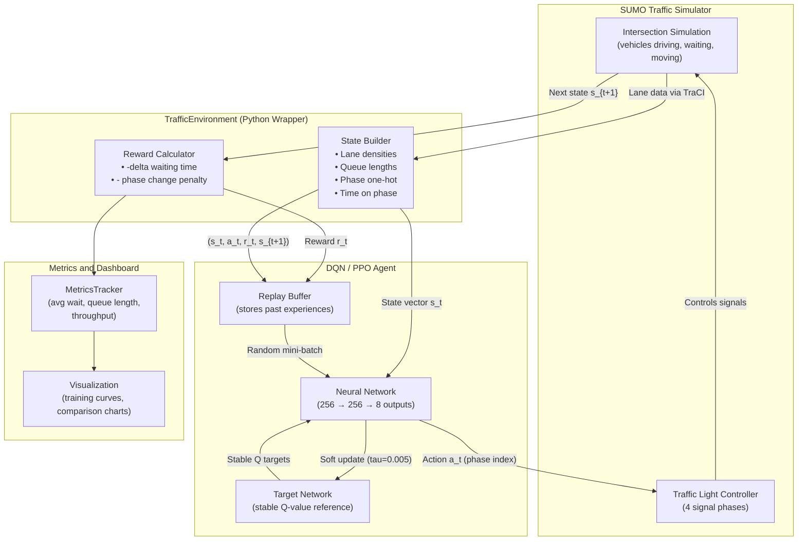

# Deep Reinforcement Learning for Smart Traffic Signal Optimization

> Teaching a computer to control traffic lights — better than a fixed timer ever could.

---

## Table of Contents

1. [What Is This Project?](#1-what-is-this-project)
2. [Why Does It Matter?](#2-why-does-it-matter)
3. [How Does It Work? — The Big Picture](#3-how-does-it-work--the-big-picture)
4. [Architecture Diagram](#4-architecture-diagram)
5. [Project File Structure](#5-project-file-structure)
6. [Installation Guide](#6-installation-guide)
   - [Step 1 — Install SUMO](#step-1--install-sumo)
   - [Step 2 — Clone This Repo](#step-2--clone-this-repo)
   - [Step 3 — Install Python Dependencies](#step-3--install-python-dependencies)
   - [Step 4 — Verify Everything Works](#step-4--verify-everything-works)
7. [Configuration File Deep-Dive](#7-configuration-file-deep-dive)
8. [Code Walkthrough](#8-code-walkthrough)
   - [8.1 — The Environment (traffic_env.py)](#81--the-environment-traffic_envpy)
   - [8.2 — The DQN Agent (dqn_agent.py)](#82--the-dqn-agent-dqn_agentpy)
   - [8.3 — The Replay Buffer (replay_buffer.py)](#83--the-replay-buffer-replay_bufferpy)
   - [8.4 — Training with Custom DQN (train.py)](#84--training-with-custom-dqn-trainpy)
   - [8.5 — Training with Stable-Baselines3 (train_dqn_sb3.py)](#85--training-with-stable-baselines3-train_dqn_sb3py)
   - [8.6 — Baseline Controllers (baselines/)](#86--baseline-controllers-baselines)
   - [8.7 — Metrics Tracker (metrics.py)](#87--metrics-tracker-metricspy)
   - [8.8 — Evaluation (evaluate.py)](#88--evaluation-evaluatepy)
9. [The MDP — States, Actions, and Rewards Explained](#9-the-mdp--states-actions-and-rewards-explained)
10. [DRL Algorithms Explained](#10-drl-algorithms-explained)
    - [DQN (Deep Q-Network)](#dqn-deep-q-network)
    - [PPO (Proximal Policy Optimization)](#ppo-proximal-policy-optimization)
11. [Baselines Explained](#11-baselines-explained)
12. [Running the Project — Step by Step](#12-running-the-project--step-by-step)
13. [Understanding the Results](#13-understanding-the-results)
14. [Performance Dashboard](#14-performance-dashboard)
15. [Troubleshooting](#15-troubleshooting)
16. [**Stage 2.1 — Real-World Delhi Intersection with Indian Vehicle Types**](#stage-21--real-world-delhi-intersection-with-indian-vehicle-types)
    - [2.1.1 — Why Delhi? Why Real Roads?](#211--why-delhi-why-real-roads)
    - [2.1.2 — How We Got the Real Road Map (OpenStreetMap)](#212--how-we-got-the-real-road-map-openstreetmap)
    - [2.1.3 — Converting OSM to SUMO Network](#213--converting-osm-to-sumo-network)
    - [2.1.4 — Indian Vehicle Types (The Soul of Delhi Traffic)](#214--indian-vehicle-types-the-soul-of-delhi-traffic)
    - [2.1.5 — Traffic Demand: How We Create 2,880 Vehicles/Hour](#215--traffic-demand-how-we-create-2880-vehicleshour)
    - [2.1.6 — The SUMO Configuration File](#216--the-sumo-configuration-file)
    - [2.1.7 — Code Changes: Making the Project Delhi-Ready](#217--code-changes-making-the-project-delhi-ready)
    - [2.1.8 — Updated File Structure](#218--updated-file-structure)
    - [2.1.9 — How to Run with the Delhi Network](#219--how-to-run-with-the-delhi-network)
    - [2.1.10 — Training Results: Delhi vs. Original Intersection](#2110--training-results-delhi-vs-original-intersection)
    - [2.1.11 — End-to-End Flow (How Everything Connects)](#2111--end-to-end-flow-how-everything-connects)
    - [2.1.12 — Regenerating Routes](#2112--regenerating-routes-if-you-want-different-traffic)
    - [2.1.13 — Summary of Stage 2.1 Changes](#2113--summary-of-stage-21-changes)
17. [References](#17-references)

---

## 1. What Is This Project?

This project trains an artificial intelligence (AI) agent to control a traffic signal at a 4-way road intersection. Instead of using old-fashioned fixed timers (30 seconds green, then red, etc.), the AI watches real-time traffic data and decides the best signal timing to **reduce how long cars wait**.

The AI is trained using **Deep Reinforcement Learning (DRL)** — a technique where the agent learns by trial and error, getting a "reward" when it makes traffic flow smoothly and a "penalty" when it causes congestion.

**Key Technologies Used:**

| Technology | What It Does |
|---|---|
| **SUMO** | A realistic traffic simulator — acts as the virtual city |
| **DQN** (Deep Q-Network) | Our custom-built RL agent |
| **PPO** (Proximal Policy Optimization) | A second RL agent from Stable-Baselines3 |
| **PyTorch** | The deep learning framework powering the neural networks |
| **sumo-rl** | A Python library that connects SUMO to OpenAI Gym |
| **Gymnasium** | The standard interface for RL environments |

---

## 2. Why Does It Matter?

Every day, millions of people sit stuck at red lights — even when the intersecting road is completely empty. This wastes:

- **Time** — the average commuter loses ~54 hours per year to traffic
- **Fuel** — idling cars burn gas and emit CO2 with zero forward progress
- **Emergency response time** — ambulances and fire trucks are delayed

Traditional "fixed-time" signals (the blinking box at the corner that just counts down 30 seconds regardless of traffic) were designed decades ago. They cannot adapt to rush hour, accidents, or unusual traffic patterns.

**Smart adaptive signals** — the kind this project builds — can observe how many cars are queued in each lane right now and choose the best green phase accordingly. Studies show adaptive signals can reduce average waiting time by **20–40%** compared to fixed timers.

This project is a research/learning platform to explore how well DRL agents can learn that behaviour, and to compare them against traditional baselines.

---

## 3. How Does It Work? — The Big Picture

Think of it like training a dog:

1. The **environment** (SUMO) acts like the world — real cars driving around a virtual intersection.
2. The **agent** (DQN or PPO) watches the world, picks an action (which signal phase to show), and gets a reward.
3. If the action reduced waiting — the reward is high (good!).
4. If the action caused more congestion — the reward is low (bad!).
5. Over hundreds of episodes, the agent learns which actions lead to better long-term outcomes.

This is **Reinforcement Learning (RL)**. We "reinforce" good behaviour over time.

The specific framework is called a **Markov Decision Process (MDP)**:

- **S** = State — what the agent sees (traffic density, queue lengths, current phase)
- **A** = Action — which signal phase to activate (0–7)
- **R** = Reward — how good that action was (negative congestion)
- **P** = Transition probability — how the world changes after the action
- **γ** = Discount factor — how much the agent cares about future rewards (0.99 here)

---

## 4. Architecture Diagram

This diagram shows how data flows through the full system:



**How to read this diagram:**
- The SUMO simulator generates real traffic (cars spawning, driving, stopping).
- Python reads the lane data via the **TraCI** API (Traffic Control Interface).
- The state vector is built and fed to the neural network.
- The network outputs Q-values for all 8 phases; the best is chosen.
- That action is sent back to SUMO which changes the traffic light.
- The reward is computed and everything is stored in the replay buffer.
- During training, random past experiences are sampled to update the neural network weights.

---

## 5. Project File Structure

```
traf/
│
├── config/
│   └── config.yaml              ← All hyperparameters in one place
│
├── networks/
│   ├── single_intersection.net.xml   ← SUMO road network (4-way intersection)
│   ├── single_intersection.rou.xml   ← Vehicle routes and traffic demand
│   ├── single_intersection.sumocfg   ← SUMO run configuration
│   ├── intersection.nod.xml          ← Node definitions (intersections)
│   └── intersection.edg.xml          ← Edge definitions (road segments)
│
├── src/
│   ├── environment/
│   │   └── traffic_env.py       ← THE ENVIRONMENT: wraps SUMO as a Gym env
│   ├── agent/
│   │   ├── dqn_agent.py         ← THE BRAIN: DQN neural network + training logic
│   │   └── replay_buffer.py     ← THE MEMORY: stores past experiences
│   ├── baselines/
│   │   ├── fixed_time_policy.py ← BASELINE 1: old-fashioned fixed timer
│   │   └── random_policy.py     ← BASELINE 2: completely random actions
│   └── utils/
│       ├── metrics.py           ← SCOREBOARD: tracks all performance numbers
│       └── visualization.py     ← CHARTS: plots graphs and dashboards
│
├── train.py                     ← Run this to train the custom DQN agent
├── train_dqn_sb3.py             ← Run this to train with Stable-Baselines3 DQN
├── evaluate.py                  ← Run this to compare all policies
├── test_env.py                  ← Sanity-check the SUMO environment
├── test_agent.py                ← Test a saved model
└── requirements.txt             ← Python package list
```

---

## 6. Installation Guide

### Step 1 — Install SUMO

SUMO (Simulation of Urban Mobility) is the traffic simulator at the heart of this project. You must install it **before** anything else.

---

#### Ubuntu / Debian Linux

```bash
# Add the SUMO repository for latest version
sudo add-apt-repository ppa:sumo/stable
sudo apt-get update

# Install SUMO and all its tools
sudo apt-get install sumo sumo-tools sumo-doc

# Set the SUMO_HOME environment variable (add to ~/.bashrc so it persists)
echo 'export SUMO_HOME="/usr/share/sumo"' >> ~/.bashrc
source ~/.bashrc

# Verify
sumo --version
```

---

#### Manjaro / Arch Linux

```bash
# Install from the AUR (Arch User Repository)
yay -S sumo

# Or using paru
paru -S sumo

# Set SUMO_HOME (add to ~/.bashrc or ~/.zshrc)
echo 'export SUMO_HOME="/usr/share/sumo"' >> ~/.bashrc
source ~/.bashrc

# If yay/paru is not installed, build from source:
sudo pacman -S git cmake python base-devel
git clone https://github.com/eclipse/sumo.git
cd sumo
mkdir build && cd build
cmake ..
make -j$(nproc)
sudo make install
```

---

#### Windows 10 / 11

1. Go to the official SUMO download page: https://sumo.dlr.de/docs/Downloads.php
2. Download the **Windows installer** (`.msi` file for the latest stable version)
3. Run the installer. Default path is usually `C:\Program Files (x86)\Eclipse\Sumo`
4. Set the `SUMO_HOME` environment variable:
   - Press `Win + S`, search for **"Edit the system environment variables"**
   - Click **"Environment Variables"**
   - Under "System variables", click **"New"**
   - **Variable name:** `SUMO_HOME`
   - **Variable value:** `C:\Program Files (x86)\Eclipse\Sumo`
   - Click OK, then OK again
5. Add SUMO to your PATH:
   - Find `Path` under "System variables" → Edit → New
   - Add: `C:\Program Files (x86)\Eclipse\Sumo\bin`
   - Click OK everywhere
6. Open a **new** PowerShell window and verify:
   ```
   sumo --version
   ```

> **Note:** The code automatically searches for SUMO in common Windows install paths, so even if you forget to set `SUMO_HOME`, it may still find it automatically.

---

### Step 2 — Clone This Repo

```bash
git clone https://github.com/your-username/traf.git
cd traf
```

---

### Step 3 — Install Python Dependencies

You need **Python 3.8 or newer**. It is strongly recommended to use a virtual environment.

```bash
# Create a virtual environment (keeps your system Python clean)
python -m venv venv

# Activate it
# On Linux/macOS:
source venv/bin/activate
# On Windows (PowerShell):
.\venv\Scripts\Activate.ps1
# On Windows (Command Prompt):
venv\Scripts\activate.bat

# Install all required packages
pip install -r requirements.txt
```

The `requirements.txt` file includes:

| Package | Purpose |
|---|---|
| `torch` | Neural network framework (DQN brain) |
| `gymnasium` | Standard RL environment interface |
| `sumo-rl` | Bridges SUMO with Python/Gymnasium |
| `stable-baselines3` | DQN and PPO algorithm implementations |
| `numpy` | Array math (state vectors, rewards) |
| `matplotlib` | Charts and performance plots |
| `pyyaml` | Reading the config file |
| `pandas` | Metric aggregation and CSV export |

---

### Step 4 — Verify Everything Works

```bash
# Quick environment test (runs SUMO for a few seconds, no training)
python test_env.py

# You should see something like:
# SUMO_HOME: C:\Program Files (x86)\Eclipse\Sumo
# State shape: (21,)
# Action space: Discrete(4)
# Test passed!
```

---

## 7. Configuration File Deep-Dive

All project settings live in `config/config.yaml`. This means you rarely need to edit source code — just change a number in the config file.

```yaml
# config/config.yaml (annotated)

environment:
  net_file: "networks/single_intersection.net.xml"  # Road layout
  route_file: "networks/single_intersection.rou.xml" # Where cars go
  use_gui: false       # true = open SUMO's visual window (slow but pretty)
  num_seconds: 3600    # Simulate 1 hour of traffic per episode
  delta_time: 5        # The agent makes a decision every 5 simulated seconds
  yellow_time: 3       # Yellow lights always last exactly 3 seconds
  min_green: 10        # A phase must stay green at least 10 seconds (safety)
  max_green: 50        # A phase can stay green at most 50 seconds

reward:
  waiting_time_weight: -1.0   # Every second of waiting = -1 reward
  phase_change_penalty: 0.1   # Switching phases costs 0.1 (discourages flip-flopping)

dqn:
  learning_rate: 0.001   # How fast the network learns (Adam optimizer)
  gamma: 0.99            # Discount factor: future rewards matter almost as much as now
  epsilon_start: 1.0     # 100% random at start (pure exploration)
  epsilon_end: 0.01      # 1% random at the end (mostly using learned policy)
  epsilon_decay: 0.995   # Each step: epsilon = epsilon * 0.995
  batch_size: 64         # Train on 64 random past experiences at once
  buffer_size: 100000    # Remember up to 100,000 past transitions
  target_update_freq: 100 # Copy online network to target every 100 steps
  hidden_layers: [256, 256] # Two hidden layers of 256 neurons each

training:
  num_episodes: 500         # Train for 500 complete episodes
  max_steps_per_episode: 720 # 3600 seconds / 5 seconds per step = 720 steps
  save_freq: 50             # Save a checkpoint every 50 episodes
  eval_freq: 25             # Run evaluation every 25 episodes
  seed: 42                  # For reproducibility
```

**Simple rule of thumb:** If training is slow, reduce `num_episodes`. If results are unstable, increase `buffer_size`. If the agent never stops exploring, increase `epsilon_decay` closer to 1.0 (e.g., 0.999).

---

## 8. Code Walkthrough

### 8.1 — The Environment (`traffic_env.py`)

**What is an "environment" in RL?**
Think of it as the virtual world the agent lives in. The environment takes an action from the agent, simulates what happens next in SUMO, and returns the new state of the world plus a reward signal.

This file contains the `TrafficEnvironment` class, which is a Python wrapper around the `sumo-rl` library.

---

#### The `__init__` Method — Setting Up the World

```python
def __init__(
    self,
    net_file: str,       # Path to the road layout XML file
    route_file: str,     # Path to the vehicle routes XML file
    use_gui: bool = False,
    num_seconds: int = 3600,    # How long the simulation runs (1 hour)
    delta_time: int = 5,        # Seconds between agent decisions
    yellow_time: int = 3,       # Yellow light duration
    min_green: int = 10,        # Minimum green phase hold time
    max_green: int = 50,        # Maximum green phase hold time
    waiting_time_weight: float = -1.0,
    phase_change_penalty: float = 0.1,
    seed: Optional[int] = None
):
```

After setting those parameters, the constructor:

1. Creates a `sumo_rl.SumoEnvironment` object (the actual SUMO connection)
2. Finds the traffic signal ID in the network (`self.ts_id`)
3. Counts the number of phases and lanes:
   - `self.num_phases` = number of distinct green phases (typically 4)
   - `self.num_lanes` = number of incoming lanes monitored (typically 8 for a 4-way intersection)
4. Calculates the **state dimension**:

```python
self.state_dim = 2 * self.num_lanes + self.num_phases + 1
#                 ^ densities + queues   ^ phase one-hot  ^ time on phase
# With 8 lanes and 4 phases: state_dim = 16 + 4 + 1 = 21
```

---

#### The `_get_state` Method — Building the State Vector

This is one of the most important methods. It translates raw SUMO data into a neat **NumPy array** that the neural network can process.

```python
def _get_state(self) -> np.ndarray:
```

Here is exactly what it collects, step by step:

**Step 1 — Lane Densities**

For each lane controlled by the traffic light:
```python
density = num_vehicles_on_lane / (lane_length_metres / 7.5)
```
- `7.5` metres is the assumed average space one vehicle takes (car length + gap)
- `lane_length / 7.5` = maximum number of vehicles that could physically fit in the lane
- This gives a value between 0.0 (empty lane) and 1.0 (bumper-to-bumper)

*Example:* If Lane 1 is 75m long, it can hold `75/7.5 = 10` vehicles. If 5 are on it, density = `5/10 = 0.5`.

**Step 2 — Queue Lengths (Normalized)**

```python
queue = halting_vehicles_on_lane / (lane_length / 7.5)
```
"Halting" means the vehicle speed is close to 0 — it is waiting at the red light. Also clamped to [0, 1].

**Step 3 — Phase One-Hot Encoding**

```python
phase_one_hot = np.zeros(self.num_phases)
phase_one_hot[ts.green_phase] = 1.0
```
A one-hot vector tells the agent which phase is currently active. For example, if phase 2 (NS left-turn) is active:
```
phase_one_hot = [0, 0, 1, 0]
```

**Step 4 — Time on Current Phase**

```python
time_normalized = min(self.time_on_phase / self.max_green, 1.0)
```
This tells the agent how long the current phase has been green. If `max_green = 50` and the phase has been on for 25 seconds, `time_normalized = 0.5`.

**Final Concatenation:**

```python
state = np.concatenate([densities, queues, phase_one_hot, [time_normalized]])
# state.shape = (21,)   dtype = float32   all values in [0.0, 1.0]
```

**Concrete Example:**

Suppose a 4-lane intersection (simplified). A state might look like:

```python
state = [0.8, 0.1, 0.0, 0.6,   # Densities: Lanes 0-3  (Lane 0 = 80% full, Lane 2 = empty)
         0.7, 0.0, 0.0, 0.5,   # Queues:    Lanes 0-3  (Lane 0 = 70% queued)
         1.0, 0.0, 0.0, 0.0,   # Phase:     Phase 0 (NS-green) is currently active
         0.4]                   # Time:      Phase has been on for 40% of max_green
```

**Reading this:** Lanes 0 and 3 (North-South direction) are very congested. Lane 0 has 80% density and 70% queue — cars are piling up. The current phase (NS-green) is already 40% through its maximum duration. A smart agent should notice this and consider whether to hold NS-green or switch to help East-West traffic.

---

#### The `_compute_reward` Method — Scoring the Agent

```python
def _compute_reward(self, action: int) -> float:
    current_waiting = self._get_total_waiting_time()

    # waiting_time_weight = -1.0 (from config)
    # If waiting time INCREASED by 10s this step: reward = -1.0 * (+10) = -10  (bad)
    # If waiting time DECREASED by 10s this step: reward = -1.0 * (-10) = +10  (good!)
    waiting_reward = self.waiting_time_weight * (current_waiting - self.prev_waiting_time)

    # Extra penalty for switching phases (prevents rapid flickering)
    phase_penalty = 0
    if self.last_phase is not None and action != self.last_phase:
        phase_penalty = self.phase_change_penalty  # = 0.1

    reward = waiting_reward - phase_penalty
    return reward
```

**In plain English:**
- Every second of total waiting time *added* to the road = -1 reward
- Switching to a different phase = extra -0.1 penalty (prevents rapidly cycling phases, which confuses drivers and causes yellow-light stuttering)
- If the agent keeps traffic flowing: waiting decreases → positive reward

---

#### The `step` Method — Running One Decision Cycle

```python
def step(self, action: int):
    obs, _, terminated, truncated, info = self.env.step(action)
    reward = self._compute_reward(action)
    state = self._get_state()
    # ... update tracking ...
    return state, reward, terminated, truncated, info
```

One call to `step()` simulates exactly `delta_time = 5` seconds of traffic in SUMO. The agent makes **720 decisions per episode** (3600 seconds / 5 seconds each).

---

### 8.2 — The DQN Agent (`dqn_agent.py`)

This file is the **brain** of the project. It contains two neural network architectures and the full DQN learning algorithm.

---

#### The `QNetwork` Class — The Standard Neural Network

```python
class QNetwork(nn.Module):
    def __init__(self, state_dim, action_dim, hidden_layers=[256, 256], activation="relu"):
```

This is a standard feedforward neural network:

```
Input layer:    21 neurons  (state_dim)
      |
Hidden layer 1: 256 neurons + ReLU activation
      |
Hidden layer 2: 256 neurons + ReLU activation
      |
Output layer:    8 neurons  (one Q-value per phase)
```

**What does the output mean?**

The network outputs a Q-value (expected total future reward) for every possible action. For example:
```python
# Input:  current state vector (shape: [21])
# Output: Q-values for each phase (shape: [8])
q_values = [-12.5, -8.3, -5.1, -15.2, -9.0, -7.7, -6.2, -11.8]
#            Ph0    Ph1   Ph2   Ph3    Ph4   Ph5   Ph6   Ph7
# Best action = phase 2 (Q = -5.1, least negative = most total future reward)
```

---

#### The `DuelingQNetwork` Class — An Improved Architecture

The Dueling architecture separates two ideas:
- **Value V(s):** "How good is this situation overall, regardless of what I do?"
- **Advantage A(s, a):** "How much better is action `a` compared to the average action?"

```
             +-------------------+
Input -----> |   Shared Layers   |
             +--------+----------+
                      |
           +----------+-----------+
           |                      |
    +--------------+     +------------------+
    |  Value Head  |     |  Advantage Head  |
    |  V(s) -> 1   |     |  A(s,a) -> 8    |
    +------+-------+     +--------+---------+
           +----------+----------+
                      |
        Q(s,a) = V(s) + A(s,a) - mean(A(s,:))
```

**Why subtract the mean of A?** It makes the advantage values unique and prevents the network from assigning arbitrary offsets. This small trick significantly stabilises training.

---

#### The `DQNAgent` Class — The Full DQN System

```python
class DQNAgent:
    def __init__(self, state_dim, action_dim,
                 learning_rate=0.001,
                 gamma=0.99,
                 epsilon_start=1.0,   # Start fully random
                 epsilon_end=0.01,    # Settle at 1% random
                 epsilon_decay=0.995, # Decay multiplier per step
                 batch_size=64,
                 buffer_size=100000,
                 target_update_freq=100,
                 use_double=True,     # Double DQN enabled by default
                 tau=0.005,           # Soft update coefficient
                 ...):
```

**Key components created inside `__init__`:**

```python
# Two copies of the same network:
self.q_network       # Online network — learns every step
self.target_network  # Target network — updated slowly for stability

# Memory:
self.replay_buffer   # Stores up to 100,000 past experiences

# Optimizer:
self.optimizer = optim.Adam(self.q_network.parameters(), lr=learning_rate)
```

---

#### The `select_action` Method — Epsilon-Greedy Exploration

```python
def select_action(self, state, training=True):
    if training and np.random.random() < self.epsilon:
        return np.random.randint(self.action_dim)  # Random action (explore)

    q_values = self.q_network(state_tensor)
    return q_values.argmax().item()                # Best known action (exploit)
```

**Epsilon-greedy explained simply:**

Imagine a new chef who does not know which dish is best. At first (high epsilon), they try a random dish every time to discover the menu. Over time (epsilon decays), once they have tasted everything, they mostly stick with the best dish they found — but occasionally try something new just in case.

| Training Progress | Epsilon | Behaviour |
|---|---|---|
| Start (step 0) | 1.00 | 100% random — pure exploration |
| Early (step 200) | ~0.36 | 36% random, 64% best known action |
| Mid (step 500) | ~0.08 | 8% random, 92% best known action |
| End (step 1000+) | 0.01 | 1% random — almost pure exploitation |

---

#### The `train_step` Method — Learning from Experience

This is where actual neural network training happens. Called once per environment step after the buffer is sufficiently full (>= batch_size).

```python
def train_step(self):
    # 1. Sample 64 random experiences from memory
    states, actions, rewards, next_states, dones = self.replay_buffer.sample(64)

    # 2. What does the network currently predict for the actions that were taken?
    current_q = self.q_network(states).gather(1, actions)
    # .gather(1, actions) picks only the Q-value for the action that was actually taken

    # 3. Compute the Bellman target (what Q SHOULD be)
    #    Double DQN: online network SELECTS the best next action...
    next_actions = self.q_network(next_states).argmax(dim=1)
    #              ...but target network EVALUATES its value (less biased)
    next_q = self.target_network(next_states).gather(1, next_actions)
    target_q = rewards + (1 - dones) * self.gamma * next_q
    #          ^ immediate reward     ^ 0 if done  ^ discounted future value

    # 4. Compute loss (Huber loss — less sensitive to outliers than MSE)
    loss = smooth_l1_loss(current_q, target_q)

    # 5. Backprop: adjust network weights to reduce loss
    self.optimizer.zero_grad()
    loss.backward()
    torch.nn.utils.clip_grad_norm_(self.q_network.parameters(), 10.0)  # Safety cap
    self.optimizer.step()

    # 6. Decay epsilon (less random exploration over time)
    self.epsilon = max(self.epsilon_end, self.epsilon * self.epsilon_decay)

    # 7. Every target_update_freq steps: softly copy weights to target network
    # target_weights = tau * online_weights + (1 - tau) * target_weights
    # tau = 0.005, so target slowly drifts toward online (not a sudden jump)
```

**Why gradient clipping?** The `clip_grad_norm_(..., 10.0)` call prevents weight updates from becoming enormous, which could cause the network to "explode" numerically. Think of it as a safety limiter on the steering wheel.

**Why the target network?** Without it, a single network trying to predict its own target is like trying to hit a moving dartboard — the target shifts every update, causing instability. The target network (updated slowly via tau=0.005) provides a stable reference point that only drifts gradually toward the latest online weights.

---

### 8.3 — The Replay Buffer (`replay_buffer.py`)

The replay buffer is the agent's **long-term memory**. Instead of learning only from the most recent experience, DQN stores thousands of past experiences and trains on random samples from them.

**Why is this needed?**

1. **Break correlations** — consecutive experiences are highly correlated (e.g., 5 steps of a red light look almost identical). Random sampling prevents the network from overfitting to recent patterns.
2. **Data efficiency** — each experience can be reused many times during training instead of being discarded immediately.

---

#### `ReplayBuffer` — Standard Memory

```python
class ReplayBuffer:
    def __init__(self, capacity=100000, state_dim=21):
        self.buffer = deque(maxlen=capacity)
        # deque = double-ended queue. When full, oldest entry auto-removed.
```

**Internal data structure:** A Python `deque` with a maximum size. Think of it like a circular queue — when you reach the end and keep adding, the oldest entries fall off the front.

Each entry stored is a 5-tuple:
```python
(state, action, reward, next_state, done)
# state:      numpy array, shape (21,), float32
# action:     integer 0-7
# reward:     float (e.g., -5.1)
# next_state: numpy array, shape (21,), float32
# done:       bool (True if episode ended)
```

**Sampling — picking a training batch:**
```python
def sample(self, batch_size=64):
    batch = random.sample(self.buffer, batch_size)  # 64 random entries, no replacement
    states      = np.array([t[0] for t in batch])   # Shape: (64, 21)
    actions     = np.array([t[1] for t in batch])   # Shape: (64,)
    rewards     = np.array([t[2] for t in batch])   # Shape: (64,)
    next_states = np.array([t[3] for t in batch])   # Shape: (64, 21)
    dones       = np.array([t[4] for t in batch])   # Shape: (64,)
    return states, actions, rewards, next_states, dones
```

---

#### `PrioritizedReplayBuffer` — Smarter Memory (Optional)

The standard buffer treats all experiences equally — a surprise breakthrough and a boring repetition have the same chance of being sampled.

**Prioritized Experience Replay (PER)** gives higher sampling probability to experiences where the agent was *most wrong* (high TD-error — the difference between predicted and actual Q-values):

```
P(experience i) = (priority_i ^ alpha) / sum(all priorities ^ alpha)
```

Where `alpha = 0.6` by default. `alpha = 0` means uniform sampling (same as standard); `alpha = 1` means full prioritization by TD-error.

**Simple analogy:** A student studying for an exam should spend more time on topics they keep getting wrong, not equally on everything. PER does exactly that.

**To enable PER:**
```yaml
# config.yaml - add under dqn section:
use_per: true
```
Or pass `use_per=True` when creating `DQNAgent`.

---

### 8.4 — Training with Custom DQN (`train.py`)

This is the main training script for the hand-coded DQN agent.

**How to run:**
```bash
python train.py                        # Default settings (500 episodes)
python train.py --episodes 200         # Shorter run for testing
python train.py --gui                  # Watch the simulation in SUMO visual window
python train.py --seed 123             # Different random seed for reproducibility
```

**The core training loop — what happens each episode:**

```python
for episode in range(1, num_episodes + 1):
    state, info = env.reset()       # Start a fresh 1-hour simulation
    episode_reward = 0

    for step in range(max_steps):  # Up to 720 steps of 5 seconds each
        # Agent picks an action using epsilon-greedy
        action = agent.select_action(state, training=True)

        # SUMO runs 5 simulated seconds, returns new world state + reward
        next_state, reward, terminated, truncated, info = env.step(action)
        done = terminated or truncated

        # Store the experience (s, a, r, s', done) in memory
        agent.store_transition(state, action, reward, next_state, done)

        # Learn from a random batch of 64 past experiences
        loss = agent.train_step()

        # Record stats for this step
        metrics.log_step(reward, info['waiting_time'], info['queue_length'], loss)

        state = next_state
        episode_reward += reward
        if done:
            break

    # After episode ends: log, print, maybe save a checkpoint
    ep_summary = metrics.end_episode(throughput, phase_changes)

    # Save the best model seen so far
    if ep_summary['reward'] > best_reward:
        agent.save(checkpoint_dir / "best_model.pt")
        best_reward = ep_summary['reward']

    # Print progress every 10 episodes
    if episode % 10 == 0:
        stats = metrics.get_recent_stats(window=100)
        print(f"Ep {episode} | Reward: {ep_reward:.1f} | "
              f"Avg(100): {stats['avg_reward']:.1f} | "
              f"Wait: {stats['avg_waiting_time']:.1f}s | epsilon: {agent.epsilon:.3f}")
```

**Output directories automatically created:**
- `checkpoints/dqn_traffic_TIMESTAMP/` — saved model weights (`.pt` files)
- `logs/dqn_traffic_TIMESTAMP/` — JSON log files with per-episode metrics

---

### 8.5 — Training with Stable-Baselines3 (`train_dqn_sb3.py`)

This script uses the **Stable-Baselines3 (SB3)** library — a well-tested, production-grade implementation of common RL algorithms. It provides automatic TensorBoard logging and handles many implementation details automatically.

**How to run:**
```bash
python train_dqn_sb3.py                         # Default (50,000 timesteps)
python train_dqn_sb3.py --timesteps 200000      # Longer training for better results
python train_dqn_sb3.py --gui                   # Enable SUMO visual window
```

**Key difference from `train.py`:**
- `train.py` uses our **custom-built** DQN with full control over architecture, PER, Double DQN, etc.
- `train_dqn_sb3.py` uses SB3's **battle-tested** DQN which is more reliable for quick results and includes automatic TensorBoard integration.

Both train the same kind of agent; use SB3 for quick reliable results and custom `train.py` for research and experimentation with novel ideas.

**Monitor training with TensorBoard:**
```bash
tensorboard --logdir ./logs/
# Then open http://localhost:6006 in your browser
```

**Saved model location:** `checkpoints/dqn_sb3_TIMESTAMP/dqn_traffic_final.zip`

---

### 8.6 — Baseline Controllers (`baselines/`)

Baselines are simple comparison policies. We compare our DRL agent against them to prove whether the AI actually learned something useful.

---

#### `FixedTimePolicy` — The Traditional Traffic Light

```python
class FixedTimePolicy:
    def __init__(self, action_dim=4,
                 ns_green_duration=30,    # North-South stays green for 30s
                 ew_green_duration=30,    # East-West stays green for 30s
                 left_turn_duration=15):  # Left turns get 15s each
```

**How it works:** It cycles through phases on a fixed timer, completely ignoring current traffic conditions.

Default cycle structure:
```
Phase 0 (NS-through):  30 seconds
Phase 1 (EW-through):  30 seconds
Phase 2 (NS-left):     15 seconds
Phase 3 (EW-left):     15 seconds
──────────────────────────────────
Total cycle duration:   90 seconds  →  repeats forever
```

The `select_action` method simply looks at where in the cycle the current time falls — it **never reads the state input**:

```python
def select_action(self, state):
    # 'state' parameter is completely ignored!
    time_in_cycle = self.total_time % self.cycle_duration
    for entry in self.schedule:
        if entry['start_time'] <= time_in_cycle < entry['end_time']:
            return entry['phase']
    self.total_time += self.delta_time
```

**This is the most common real-world setup.** Even though it ignores actual traffic, a well-tuned fixed timer is surprisingly decent — it is the primary bar our AI needs to beat.

---

#### `RandomPolicy` — The Floor Baseline

```python
class RandomPolicy:
    def select_action(self, state):
        return np.random.randint(self.action_dim)  # Completely random every 5 seconds
```

This picks a random phase every 5 seconds with no logic whatsoever. It represents the absolute worst intelligent behaviour. If our agent cannot beat random, something is seriously wrong with the training setup.

---

### 8.7 — Metrics Tracker (`metrics.py`)

The `MetricsTracker` class acts as the scoreboard for an entire training run. It collects numbers at every step, aggregates them per episode, and provides statistical summaries.

**What it tracks:**

```python
class MetricsTracker:
    # Per-episode accumulated records:
    self.episode_rewards       = []  # Total reward per episode
    self.episode_waiting_times = []  # Avg waiting time per episode (seconds)
    self.episode_queue_lengths = []  # Avg queue length per episode (vehicles)
    self.episode_throughputs   = []  # Vehicles completing trips per episode
    self.episode_phase_changes = []  # How many times signal switched phases
```

**Key methods — the typical usage flow:**

```python
# Called at the START of each episode:
metrics.start_episode()

# Called at EVERY step inside the episode loop:
metrics.log_step(
    reward=r,
    waiting_time=info['waiting_time'],
    queue_length=info['queue_length'],
    loss=train_loss          # Pass None if not training
)

# Called at the END of each episode — returns a summary dict:
ep_summary = metrics.end_episode(throughput=1204, phase_changes=48)
# ep_summary = {
#   'episode': 50,
#   'reward': -1823.5,
#   'avg_waiting_time': 72.1,
#   'avg_queue_length': 6.9,
#   'throughput': 1204,
#   'phase_changes': 48
# }

# Get rolling statistics over the last N episodes:
stats = metrics.get_recent_stats(window=100)
# Used for the console progress printout
```

**All data is saved as JSON** in `logs/[experiment_name]/metrics.json` after training completes, which can be loaded later for generating charts without rerunning training.

---

### 8.8 — Evaluation (`evaluate.py`)

This script runs all three policies (DQN agent, Fixed-Time, Random) side-by-side on the same environment and produces a comparison table.

**How to run:**
```bash
# After training completes, point to your checkpoint
python evaluate.py --model checkpoints/dqn_traffic_TIMESTAMP/best_model.pt

# More episodes for statistical confidence (reduces noise)
python evaluate.py --model checkpoints/best_model.pt --episodes 20

# Watch the evaluation live in the SUMO graphical window
python evaluate.py --model checkpoints/best_model.pt --gui --episodes 5
```

**What `evaluate_policy()` does:**

For each of `num_episodes` episodes:
- Reset the environment and the policy
- Run a complete episode with the policy in control (no exploration for DQN — `training=False`)
- After each episode, record: average wait time, queue, throughput

```python
def evaluate_policy(env, policy, num_episodes, policy_name):
    for ep in range(num_episodes):
        state, _ = env.reset()
        done = False
        while not done:
            # For DQN agent: training=False disables epsilon-greedy random exploration
            action = policy.select_action(state, training=False)
            next_state, reward, terminated, truncated, info = env.step(action)
            done = terminated or truncated
            state = next_state
        result.add_episode(reward, waiting_time, queue_length, ...)
    return result
```

**Sample output:**

```
╔══════════════════════╦══════════════╦══════════════╦══════════════╗
║ Policy               ║ Avg Wait (s) ║ Avg Queue    ║ Throughput   ║
╠══════════════════════╬══════════════╬══════════════╬══════════════╣
║ DQN Agent            ║     38.2     ║     4.1      ║    1,204     ║
║ Fixed-Time (30s/30s) ║     54.7     ║     6.8      ║    1,087     ║
║ Random Policy        ║     91.3     ║    12.4      ║      743     ║
╚══════════════════════╩══════════════╩══════════════╩══════════════╝
DQN vs Fixed-Time: 30.2% reduction in average waiting time
DQN vs Random:     58.2% reduction in average waiting time
```

---

## 9. The MDP — States, Actions, and Rewards Explained

### States — What the Agent Sees

**Data type:** `numpy.ndarray` with shape `(21,)` and `dtype=float32`
**Value range:** All values normalized to `[0.0, 1.0]`

| Index Range | What It Represents | Example Value |
|---|---|---|
| 0 – 7 | Lane densities: (vehicles on lane) / (lane capacity) | 0.4 = lane is 40% full |
| 8 – 15 | Lane queues: (halted vehicles) / (lane capacity) | 0.7 = 70% of lane is gridlocked |
| 16 – 19 | Phase one-hot vector: which of 4 phases is currently active | [0,1,0,0] = Phase 1 is active |
| 20 | Time on current phase, normalized by max_green | 0.5 = halfway through max hold time |

**Real example with full interpretation:**
```
Indices 0-7  (densities): [0.85, 0.20, 0.10, 0.75, 0.05, 0.30, 0.15, 0.45]
                                                                ^ NB heavy  ^ WB heavy

Indices 8-15 (queues):    [0.80, 0.10, 0.05, 0.70, 0.02, 0.15, 0.08, 0.40]
                                                     ^ lots of cars waiting at WB red

Indices 16-19 (phase):    [1.0, 0.0, 0.0, 0.0]
                           ^ Phase 0 (NS-through green) is currently active

Index 20 (time):          0.90
                           ^ Phase has been running for 90% of its maximum allowed duration
```

**Agent reasoning:** North and West lanes are heavily congested and backing up. The NS-through phase is almost maxed out. The agent should switch to allow westbound traffic to clear.

---

### Actions — What the Agent Can Do

**Data type:** Single integer in `[0, num_phases - 1]`

| Action Integer | Phase Name | Which Cars Get Green |
|---|---|---|
| 0 | NS-through | North & South straight-ahead lanes |
| 1 | EW-through | East & West straight-ahead lanes |
| 2 | NS-left | North & South left-turn lanes |
| 3 | EW-left | East & West left-turn lanes |

> **Yellow light note:** When the agent switches from Phase 0 to Phase 1, SUMO-RL automatically inserts a 3-second yellow phase. The agent does not need to command yellow explicitly — it just picks the desired next green.

---

### Rewards — How Good Was the Action?

**Reward formula:**

```
reward = waiting_time_weight * delta_waiting_time - phase_change_penalty * did_switch

where:
  delta_waiting_time = total_waiting_this_step - total_waiting_last_step
  waiting_time_weight = -1.0  (from config)
  phase_change_penalty = 0.1  (from config)
  did_switch = 1 if action != previous_action, else 0
```

**Worked examples:**

| Scenario | Delta Wait | Switched? | Reward |
|---|---|---|---|
| Heavy flow, cars clearing fast | -20s | No | +20.0 |
| Red light backed up badly | +15s | Yes | -15.1 |
| Neutral step (wait unchanged) | 0s | No | 0.0 |
| Unnecessary phase switch | +2s | Yes | -2.1 |

**Cumulative reward** over 720 steps is the sum of all step rewards. A perfectly smooth intersection (no waiting at all) would score 0. Real scores are negative but close to 0 is better.

---

## 10. DRL Algorithms Explained

### DQN (Deep Q-Network)

DQN was introduced by DeepMind in 2013 and is the foundation of this project. It combines classic Q-learning with deep neural networks to handle the large, continuous state space.

**The core idea — Q-Learning:**

Q-learning maintains a table (or in this case, a neural network) that answers the question: *"If I am in state s and take action a, what is the total future reward I can expect?"*

The answer is the Q-value: `Q(s, a)`

The Bellman equation tells us what Q should be:

```
Q(s, a) = immediate_reward + gamma * max Q(next_state, all_actions)
```

In plain English: *"The value of this (state, action) pair = the reward I get right now PLUS the discounted value of being in the next state, assuming I act optimally from there."*

**Double DQN** (enabled by default in this project via `use_double=True`):

Standard DQN tends to overestimate Q-values because it uses the same network to both select AND evaluate the best next action. This creates an upward bias.

Double DQN separates these two roles:

```python
# Standard DQN (biased upward):
target = r + gamma * max( Q_target(s', :) )

# Double DQN (unbiased):
best_next_action = argmax( Q_online(s', :) )    # Online network SELECTS action
target = r + gamma * Q_target(s', best_next_action)  # Target network EVALUATES it
```

**Dueling DQN** (optional, enable with `use_dueling=True`):

Splits the network into a value stream V(s) and advantage stream A(s,a):
```
Q(s, a) = V(s) + A(s, a) - mean(A(s, :))
```
This allows the value of a state to be learned independently from the relative advantage of individual actions — converges faster when many actions have similar Q-values.

---

### PPO (Proximal Policy Optimization)

PPO is a different class of algorithm — instead of learning Q-values (action values), it directly learns a **policy**: a probability distribution over actions given the current state.

PPO is available via Stable-Baselines3. To use it, swap the import in a training script:

```python
from stable_baselines3 import PPO

model = PPO(
    "MlpPolicy",
    env,
    verbose=1,
    n_steps=2048,      # Steps collected before each update
    batch_size=64,
    n_epochs=10,
    gamma=0.99,
    learning_rate=3e-4,
    clip_range=0.2,    # The "proximal" constraint — prevents huge policy changes
)
model.learn(total_timesteps=200000)
```

**The key PPO idea — clipped objective:**

PPO prevents the policy from changing too drastically in a single update step. If the new policy diverges too far from the old one, the update is clipped:

```
L_clip = min( r(theta)*A, clip(r(theta), 1-eps, 1+eps)*A )

where:
  r(theta) = new_policy_probability / old_policy_probability
  A = advantage estimate (how much better was this action than average?)
  eps = 0.2 (the clip range)
```

**When to use which algorithm:**

| Feature | Custom DQN | SB3 DQN | PPO |
|---|---|---|---|
| Sample efficiency | High (replay buffer) | High | Medium |
| Stability | Moderate | High | Very high |
| Speed per update | Fast | Fast | Slower |
| Best for | Research/experimentation | Quick solid results | Long stable runs |
| Supports PER | Yes (our impl.) | Limited | No |

---

## 11. Baselines Explained

Two simple baselines benchmark the AI against traditional approaches:

### Why Do We Need Baselines?

Without baselines, we cannot know if the AI actually learned anything useful. If our DRL agent achieves an average wait time of 45 seconds, is that good? We need the fixed-timer to give context: "The traditional approach takes 60 seconds, so the AI is 25% better."

### Fixed-Time Controller — The Real-World Standard

This is the dominant real-world approach. It knows nothing about current traffic — it just follows a pre-set schedule.

```
Cycle: [NS-green 30s] → [yellow 3s] → [EW-green 30s] → [yellow 3s] → repeat
Total cycle time per direction: ~33 seconds, full cycle ~66 seconds
```

**Strengths:** Simple, predictable, safe, zero computation needed, city engineers understand it deeply

**Weaknesses:** Cannot adapt to fluctuating traffic demand. At 3am with zero cars on side streets, it still makes main-road traffic wait 30 seconds for nothing.

### Random Controller — The Absolute Floor

Picks a random one of 4 phases every 5 seconds. Meant only to establish a lower bound.

If our DRL agent performs similarly to random, it has learned nothing despite weeks of training — back to the drawing board.

---

## 12. Running the Project — Step by Step

### Quick-Start (Recommended for First Run)

```bash
# 1. Activate virtual environment
source venv/bin/activate          # Linux/macOS
.\venv\Scripts\Activate.ps1       # Windows PowerShell

# 2. Verify SUMO is working
python test_env.py

# 3. Train with Stable-Baselines3 (simpler, recommended for first run)
python train_dqn_sb3.py --timesteps 50000
# Takes about 20-40 minutes depending on your machine

# 4. Evaluate and compare against baselines
python evaluate.py --model checkpoints/dqn_sb3_TIMESTAMP/dqn_traffic_final.zip
```

### Full Research Run

```bash
# Train custom DQN for 500 episodes (~1-3 hours depending on machine)
python train.py --episodes 500

# Monitor training in real-time via console output:
# Episode 50/500  | Reward: -2341.2 | Avg(100): -2341.2 | Wait: 89.3s | ε: 0.78
# Episode 100/500 | Reward: -1823.5 | Avg(100): -2082.4 | Wait: 72.1s | ε: 0.61
# Episode 200/500 | Reward: -1102.8 | Avg(100): -1453.1 | Wait: 45.2s | ε: 0.37
# [reward improves and wait time decreases as learning progresses]

# Evaluate with 20 episodes per policy for statistical reliability
python evaluate.py \
    --model checkpoints/dqn_traffic_TIMESTAMP/best_model.pt \
    --episodes 20
```

### Watch Training in SUMO GUI (Educational)

```bash
# Warning: GUI slows down simulation by ~10x
python train.py --episodes 10 --gui
# You will see coloured arrows appearing on lanes as the agent controls the lights
```

### Use TensorBoard (SB3 Training)

```bash
# In one terminal: start training
python train_dqn_sb3.py --timesteps 100000

# In another terminal: launch TensorBoard
tensorboard --logdir ./logs/
# Open: http://localhost:6006
# Charts auto-update as training progresses
```

---

## 13. Understanding the Results

After evaluation, interpret the metrics as follows:

### Average Waiting Time (seconds per vehicle)

**Lower is better.** This is the primary metric — it directly measures driver experience.

```
Typical good results:
  DQN Agent:    35-45 seconds   (well-trained after 300+ episodes)
  Fixed-Time:   50-65 seconds
  Random:       80-110 seconds
```

A well-trained DQN should beat fixed-time by **20–40%** consistently.

### Average Queue Length (vehicles)

How many cars are stopped at any moment averaged over an episode. Lower = better throughput.

### Throughput (vehicles completing trips)

How many vehicles successfully crossed the intersection end-to-end in one hour. Higher = better.

### Training Curve Interpretation

The most important chart to watch during training is the **rolling average reward over the last 100 episodes**. It should follow this pattern:

```
Episode:  1-50   → Flat/declining (buffer filling up, mostly random actions)
Episode: 50-100  → Starts improving (epsilon drops below 0.5, learning kicks in)
Episode: 100-300 → Steady improvement (agent learning key patterns)
Episode: 300-500 → Plateauing (agent has found a good policy, minor refinements)
```

**Warning signs:**
- Flat reward for 200+ consecutive episodes = likely a hyperparameter issue
- Sudden reward collapse mid-training = learning rate may be too high
- Reward never above random baseline = check environment setup

---

## 14. Performance Dashboard

Training automatically generates charts in the `logs/` directory. Evaluation generates comparison charts in `results/`.

**Charts automatically generated:**

| Chart | What It Shows | How to Interpret |
|---|---|---|
| Episode reward curve | Total reward per episode + smoothed average | Should trend upward |
| Average waiting time | Per-episode mean vehicle wait time | Should trend downward |
| Queue length over time | Per-episode mean queue | Should trend downward |
| Epsilon decay curve | Exploration rate over training steps | Smooth decay from 1.0 to 0.01 |
| Loss curve | Neural network training loss | Should decrease and stabilise |
| Policy comparison bar chart | DQN vs Fixed vs Random on all metrics | DQN bars should be shortest |

**To regenerate charts manually from saved logs:**

```python
from src.utils.visualization import plot_training_curves, plot_comparison

# Load and plot training history
plot_training_curves("logs/dqn_traffic_TIMESTAMP/metrics.json",
                     save_path="results/training_curves.png")

# Load and plot policy comparison
plot_comparison("results/TIMESTAMP/evaluation_results.json",
                save_path="results/comparison_chart.png")
```

---

## 15. Troubleshooting

### Problem: `SUMO_HOME not found!`

```bash
# Verify SUMO is installed
sumo --version

# Linux: add to shell config
echo 'export SUMO_HOME="/usr/share/sumo"' >> ~/.bashrc && source ~/.bashrc

# Windows: set via System Properties > Environment Variables
# Variable name: SUMO_HOME
# Variable value: C:\Program Files (x86)\Eclipse\Sumo
```

### Problem: `ModuleNotFoundError: No module named 'sumo_rl'`

```bash
# Make sure virtual environment is active (you should see (venv) in your prompt)
pip install sumo-rl
```

### Problem: TraCI connection fails / SUMO crashes at startup

- Verify the network and route files exist: `networks/single_intersection.net.xml`
- Try running SUMO manually: `sumo -c networks/single_intersection.sumocfg`
- Only one SUMO instance can run per TCP port at a time. If a previous training run crashed:
  - Linux: `pkill -f sumo`
  - Windows: Open Task Manager → find `sumo.exe` → End Task

### Problem: Training is extremely slow

- Confirm `use_gui: false` in `config.yaml` — the GUI slows simulation 10x
- Verify GPU acceleration is working:
  ```python
  import torch; print(torch.cuda.is_available())  # Should print True
  ```
- Reduce `num_seconds` to `1800` for shorter episodes

### Problem: Reward never improves after 200 episodes

- The replay buffer may not have filled yet — ensure `buffer_size` is not too large relative to episode count
- Try reducing `epsilon_decay` toward `0.999` so the agent explores longer before committing
- Enable `use_per: true` (prioritized replay) in config — focuses training on surprising transitions
- Enable `use_dueling: true` for the Dueling DQN architecture which is often more sample-efficient

### Problem: `RuntimeError: CUDA out of memory`

```yaml
# Add to dqn section in config.yaml:
device: "cpu"
```
Or reduce `batch_size` to 32.

### Problem: Evaluation shows DQN worse than Fixed-Time

This means training did not converge sufficiently. Try:
1. Train for more episodes (increase `num_episodes` to 1000)
2. Check that `epsilon` actually dropped below 0.10 by the end
3. Look at the reward curve — if it never improved from the first episode, check the environment setup
4. Try a higher `learning_rate` (e.g., 0.003) for faster early learning

---

## Stage 2.1 — Real-World Delhi Intersection with Indian Vehicle Types

> **What changed?** We replaced the simple toy intersection with a **real road network from Delhi, India** and added **five types of Indian vehicles** (two-wheelers, cars, auto-rickshaws, buses, and ambulances). This section explains everything that was done, **why** it was done, and **how** every piece connects — from satellite coordinates to simulated traffic.

---

### 2.1.1 — Why Delhi? Why Real Roads?

**The problem with the original setup:**

The original project used a **hand-made, 4-way intersection** — a simple cross-shaped road that we designed ourselves. Think of it like practicing chess against yourself: useful for learning the rules, but not representative of a real game.

Real cities like **Delhi** have:
- Roads that are **not perfectly straight** — they curve, merge, split
- Intersections with **irregular angles** — not neat 90° crosses
- Roads of **different widths** — a 6-lane highway meets a 2-lane street
- **Multiple traffic lights** in close proximity — not just one
- **Mixed traffic** — auto-rickshaws, bikes, buses, cars all sharing space

To build an AI that could actually work in Delhi, **we need to train it on Delhi's real roads**.

**The coordinates we used:** `28.632308, 77.220225`

This is a spot in **Central Delhi** — near major government and commercial areas. If you paste these coordinates into Google Maps, you'll see a dense network of roads with heavy daily traffic.

---

### 2.1.2 — How We Got the Real Road Map (OpenStreetMap)

**What is OpenStreetMap (OSM)?**

OpenStreetMap is like a free, open-source version of Google Maps. Thousands of volunteers around the world have mapped every road, lane, and traffic light. Anyone can download this data for free.

**What we did — step by step:**

```
Step 1: Pick the location
   └── Coordinates: 28.632308 (latitude), 77.220225 (longitude)
   └── This is in Central Delhi

Step 2: Define a bounding box (a rectangle around our area)
   └── We took a ~600m × ~600m area around those coordinates
   └── South-West corner: 28.6293, 77.2172
   └── North-East corner: 28.6353, 77.2232

Step 3: Download the raw map data
   └── We sent a request to the OSM API:
       https://api.openstreetmap.org/api/0.6/map?bbox=77.2172,28.6293,77.2232,28.6353
   └── This returned an XML file (~2 MB) containing every road, junction,
       traffic signal, building outline, etc. in that rectangle

Step 4: Save it as delhi_intersection.osm
```

**What does the OSM file contain?**

Think of it as a giant list of:
- **Nodes** — individual points on the map (like dots on graph paper), each with a latitude and longitude
- **Ways** — sequences of nodes that form roads, paths, or building outlines
- **Relations** — groups of ways (like "this road has 3 lanes going north and 2 going south")
- **Tags** — labels on each element (e.g., `highway=primary`, `lanes=4`, `name=Ring Road`)

```
Example entry in the OSM file:

<node id="12345" lat="28.6323" lon="77.2202"/>   ← A point on the map
<way id="67890">                                  ← A road segment
  <nd ref="12345"/>                               ← Uses that point
  <nd ref="12346"/>                               ← And another point
  <tag k="highway" v="primary"/>                  ← It's a main road
  <tag k="lanes" v="4"/>                          ← 4 lanes wide
  <tag k="name" v="Janpath"/>                     ← Road name
</way>
```

---

### 2.1.3 — Converting OSM to SUMO Network

**The problem:** SUMO (our traffic simulator) cannot directly read OSM files. OSM describes the *geography* of roads, but SUMO needs the *traffic engineering* details — lane widths, turn permissions, traffic light programs, junction geometries, etc.

**The solution:** We used SUMO's built-in tool called `netconvert` to translate the OSM map into a SUMO network.

```bash
netconvert \
  --osm-files delhi_intersection.osm \       # Input: raw OpenStreetMap data
  --output-file delhi_intersection.net.xml \  # Output: SUMO network file
  --geometry.remove \                         # Simplify road shapes (faster simulation)
  --roundabouts.guess \                       # Auto-detect roundabouts
  --ramps.guess \                             # Auto-detect highway ramps
  --junctions.join \                          # Merge very close junctions into one
  --tls.guess-signals true \                  # Detect where traffic lights should be
  --tls.discard-simple \                      # Remove trivial traffic lights
  --tls.join \                                # Combine related traffic lights
  --tls.default-type actuated \               # Use smart signal timing as default
  --tls.guess true \                          # Guess additional traffic light locations
  --edges.join \                              # Merge parallel road segments
  --remove-edges.isolated \                   # Remove dead-end road fragments
  --no-turnarounds true \                     # Don't allow instant U-turns
  --junctions.corner-detail 5 \               # Smooth junction corners (5 points)
  --output.street-names true                  # Preserve road names from OSM
```

**What does each flag mean? (In plain English)**

| Flag | What It Does | Why We Need It |
|------|-------------|----------------|
| `--geometry.remove` | Removes unnecessary intermediate road points | Makes simulation faster without losing accuracy |
| `--roundabouts.guess` | Automatically finds roundabouts in the map | Roundabouts have special traffic rules |
| `--junctions.join` | Combines junctions that are too close together | In OSM, one real intersection might be split into 3-4 nodes |
| `--tls.guess-signals` | Detects traffic lights from the map data | We need to know where signals are for our AI to control them |
| `--tls.join` | Merges multiple signal heads at one intersection | A physical intersection might have 4+ signal heads that should act as one |
| `--tls.default-type actuated` | Sets signals to smart-responsive type | Better default than fixed-time for our RL training |
| `--remove-edges.isolated` | Removes disconnected road fragments | These would trap vehicles and break the simulation |
| `--no-turnarounds` | Prevents instant 180° U-turns | Unrealistic — cars don't instantly reverse on busy Delhi roads |

**The result:** A SUMO network file with:

| Metric | Count |
|--------|-------|
| **Road segments (edges)** | 771 |
| **Junctions** | 558 |
| **Traffic lights** | 4 |

This is a **massive** upgrade from the original toy intersection (which had ~12 edges and 1 traffic light).

---

### 2.1.4 — Indian Vehicle Types (The Soul of Delhi Traffic)

**Why this matters:**

Delhi traffic is fundamentally different from Western traffic. In London or New York, traffic is mostly cars of similar sizes. In Delhi, you have:

- A **motorcycle** weaving between cars
- An **auto-rickshaw** (three-wheeled taxi) making a sudden turn
- A **DTC bus** (12 meters long!) blocking the entire lane
- A **car** trying to merge
- An **ambulance** blaring its siren needing everyone to clear the way

Each vehicle type has different **size, speed, acceleration, and driving behaviour**. If we train our AI only with cars, it would fail miserably on real Delhi roads.

**The five vehicle types we created:**

#### 🏍️ Two-Wheeler (Motorcycle / Scooter) — 40% of Delhi Traffic

```
What:  The most common vehicle on Delhi roads
Size:  2.0m long × 0.8m wide (very small!)
Speed: Up to 60 km/h (16.67 m/s)
Accel: 2.0 m/s² (quick off the line)
Gap:   Only needs 1.0m gap to the vehicle ahead
Sigma: 0.8 (drives somewhat unpredictably — lane splitting, weaving)

In SUMO terms:
  vClass = "motorcycle" (SUMO knows motorcycles can squeeze between cars)
  guiShape = "motorcycle" (looks like a bike in the GUI)
  color = blue
```

**Why sigma = 0.8?** Sigma (σ) controls how "imperfect" a driver is. A value of 0.0 means perfect robotic driving. A value of 1.0 means very random. Two-wheelers in Delhi drive somewhat unpredictably — they weave between lanes, squeeze through gaps — so 0.8 is realistic.

#### 🛺 Three-Wheeler (Auto-Rickshaw) — 15% of Delhi Traffic

```
What:  The iconic green-and-yellow auto, backbone of Delhi commute
Size:  2.8m long × 1.4m wide (compact but wider than a bike)
Speed: Up to 40 km/h (11.11 m/s) — they're slow!
Accel: 1.5 m/s² (sluggish acceleration)
Gap:   Needs 1.5m gap
Sigma: 0.9 (very unpredictable — sudden stops, lane changes)

Speed factor: 0.7 (they typically drive at only 70% of the road's speed limit)

In SUMO:
  color = green (like real Delhi autos!)
  guiShape = "passenger/sedan" (closest available shape)
```

**Why speed factor = 0.7?** Auto-rickshaws are mechanically limited — their small engines can't keep up with car-speed traffic. They naturally drive slower than the posted speed limit, creating an obstruction that cars must navigate around. This is a critical feature of Delhi traffic!

#### 🚗 Car (4-Wheeler) — 30% of Delhi Traffic

```
What:  Standard passenger car (Maruti, Hyundai, etc.)
Size:  4.5m long × 1.8m wide (standard car)
Speed: Up to 60 km/h (16.67 m/s)
Accel: 2.6 m/s² (moderate acceleration)
Gap:   Needs 2.5m gap
Sigma: 0.5 (moderate driving variation — Delhi drivers are aggressive but predictable)

In SUMO:
  color = yellow
  guiShape = "passenger"
```

#### 🚌 Bus (DTC / Cluster Bus) — 10% of Delhi Traffic

```
What:  Large public transport buses (DTC, Cluster, Blueline)
Size:  12.0m long × 2.5m wide × 3.2m tall (massive!)
Speed: Up to 50 km/h (13.89 m/s)
Accel: 1.2 m/s² (very slow to accelerate — heavy vehicle)
Gap:   Needs 3.0m gap (long stopping distance)
Sigma: 0.4 (more predictable — professional drivers, fixed routes)

Speed factor: 0.8 (buses don't drive at full speed limit)

In SUMO:
  vClass = "bus" (SUMO gives them bus-lane access)
  color = red
  guiShape = "bus"
```

**Why buses matter for the AI:** A single bus occupies the same space as ~3 cars. When a bus is in a queue, it dramatically increases the "density" reading on that lane. Our AI must learn that a lane with 2 buses is actually MORE congested than a lane with 4 cars, even though it has fewer vehicles.

#### 🚑 Ambulance (Emergency Vehicle) — 1% of Traffic

```
What:  Emergency vehicles (ambulances, fire trucks)
Size:  5.5m long × 2.0m wide
Speed: Up to 80 km/h (22.22 m/s) — FAST
Accel: 3.0 m/s² (powerful engine)
Gap:   2.5m
Sigma: 0.3 (very disciplined driving)

Speed factor: 1.2 (they EXCEED the normal speed limit)

In SUMO:
  vClass = "emergency" (SUMO gives them right-of-way privileges)
  color = white
  guiShape = "emergency" (flashing lights in the GUI!)
```

**Why ambulances matter for the AI:** Even though ambulances are only ~1% of traffic, they represent **life-or-death situations**. In a future version, our AI could learn to **prioritize clearing the path** for emergency vehicles — something that fixed-time signals can never do.

**Vehicle type definition file:** `networks/delhi/delhi_vtypes.add.xml`

This file uses SUMO's XML format:

```xml
<!-- Example: How we define a two-wheeler in SUMO -->
<vType id="two_wheeler"         ← Unique name
       vClass="motorcycle"      ← SUMO vehicle class (affects lane access)
       length="2.0"             ← Physical length in meters
       width="0.8"              ← Physical width in meters
       height="1.5"             ← Physical height in meters
       minGap="1.0"             ← Minimum space to vehicle ahead
       maxSpeed="16.67"         ← Maximum speed in m/s (= 60 km/h)
       accel="2.0"              ← Maximum acceleration in m/s²
       decel="4.0"              ← Maximum braking deceleration
       sigma="0.8"              ← Driver imperfection (0=perfect, 1=chaotic)
       speedFactor="1.0"        ← Multiplier on speed limit
       speedDev="0.2"           ← Random variation in desired speed
       color="0.2,0.6,1.0"     ← RGB color for GUI (blue)
       guiShape="motorcycle" /> ← Visual shape in SUMO-GUI
```

---

### 2.1.5 — Traffic Demand: How We Create 2,880 Vehicles/Hour

**What is "traffic demand"?**

The network file (`.net.xml`) defines the **roads**. But roads alone are like an empty stage — no actors! We need to tell SUMO **where vehicles start, where they go, and when they depart**.

This is called the **route file** (`.rou.xml`), and it contains "trips" — each trip says:

```xml
<trip id="car42"              ← Unique vehicle ID
     depart="123.45"          ← When it enters the simulation (seconds)
     from="some_edge_id"      ← Starting road segment
     to="another_edge_id"     ← Destination road segment
     type="car" />            ← Which vehicle type it is
```

SUMO automatically finds the shortest path between the "from" and "to" edges.

**How we generated realistic traffic:**

We used SUMO's built-in tool `randomTrips.py` to generate random but realistic trips. We ran it **once for each vehicle type**, with different frequencies:

```
Vehicle Type      Period     Vehicles/Hour    % of Total    Meaning
─────────────────────────────────────────────────────────────────────
Two-wheeler       3.0s       ~1,200           41.7%         1 new bike every 3 seconds
Car               4.0s       ~900             31.2%         1 new car every 4 seconds
Three-wheeler     8.0s       ~450             15.6%         1 new auto every 8 seconds
Bus               12.0s      ~300             10.4%         1 new bus every 12 seconds
Ambulance         120.0s     ~30              1.0%          1 ambulance every 2 minutes
─────────────────────────────────────────────────────────────────────
TOTAL                        ~2,880           100%          Heavy metro traffic!
```

**What does "period = 3.0s" mean?**

It means one new two-wheeler enters the simulation every 3 seconds on average. Over 3600 seconds (1 hour), that's 3600 ÷ 3 = 1,200 two-wheelers.

**The fringe factor (= 10):**

We set `--fringe-factor 10`, which means vehicles are **10× more likely to start from the edges (boundaries) of our map** rather than from the middle. This is realistic — in real life, traffic enters an area from surrounding roads, it doesn't magically appear in the center of an intersection.

**After generation, all trips were merged and sorted by departure time** into a single file: `delhi_intersection.rou.xml`.

This means at second 0.00 of the simulation, the first vehicles enter. By second 1.00, there might already be 3-4 vehicles. By second 300 (5 minutes), hundreds of vehicles are flowing through the network. By second 1800 (30 minutes), the roads are packed with Delhi-level congestion.

---

### 2.1.6 — The SUMO Configuration File

The `.sumocfg` file ties everything together — it tells SUMO: "Use this network, these routes, these vehicle types, and simulate for this long."

**File:** `networks/delhi/delhi_intersection.sumocfg`

```xml
<configuration>
    <input>
        <net-file value="delhi_intersection.net.xml"/>        ← The road map
        <route-files value="delhi_intersection.rou.xml"/>     ← The vehicles
        <additional-files value="delhi_vtypes.add.xml"/>      ← Vehicle type definitions
    </input>

    <time>
        <begin value="0"/>          ← Start at second 0
        <end value="3600"/>         ← Stop after 1 hour (3600 seconds)
        <step-length value="1"/>    ← Simulate in 1-second increments
    </time>

    <processing>
        <time-to-teleport value="300"/>   ← If a vehicle is stuck for 5 minutes,
                                              teleport it (prevents deadlocks)
        <collision.action value="warn"/>  ← Warn (don't crash) on collisions
    </processing>
</configuration>
```

**Why `time-to-teleport = 300`?**

In heavy Delhi traffic, vehicles can get stuck in gridlock. Without this setting, a stuck vehicle would block the road forever, causing the entire simulation to freeze. With `300`, if a vehicle hasn't moved for 5 minutes, SUMO magically teleports it to its destination (and logs a warning). This keeps the simulation running even in extreme congestion.

The original toy intersection used `-1` (infinite patience), which was fine for light traffic but would deadlock with 2,880 vehicles/hour.

---

### 2.1.7 — Code Changes: Making the Project Delhi-Ready

We made targeted changes to two files so the entire training pipeline works seamlessly with the Delhi network.

#### Change 1: `config/config.yaml` — Pointing to Delhi

```yaml
# BEFORE (Stage 1 — toy intersection):
environment:
  net_file: "networks/single_intersection.net.xml"
  route_file: "networks/single_intersection.rou.xml"
  sumo_cfg: "networks/single_intersection.sumocfg"

# AFTER (Stage 2.1 — real Delhi intersection):
environment:
  net_file: "networks/delhi/delhi_intersection.net.xml"
  route_file: "networks/delhi/delhi_intersection.rou.xml"
  sumo_cfg: "networks/delhi/delhi_intersection.sumocfg"
  additional_file: "networks/delhi/delhi_vtypes.add.xml"
```

**What changed:** We pointed the config to the new Delhi network files and added a new `additional_file` field for the vehicle type definitions.

#### Change 2: `src/environment/traffic_env.py` — Supporting Additional Files

We added an `additional_file` parameter to the `TrafficEnvironment` class so it can pass vehicle type definitions to the SUMO simulator:

```python
# BEFORE:
def __init__(self, net_file, route_file, use_gui, ...):
    self.env = sumo_rl.SumoEnvironment(
        net_file=net_file,
        route_file=route_file,
        ...
    )

# AFTER:
def __init__(self, net_file, route_file, use_gui, ..., additional_file=None):
    sumo_kwargs = dict(
        net_file=net_file,
        route_file=route_file,
        ...
    )
    if additional_file:
        sumo_kwargs['additional_file'] = additional_file
    self.env = sumo_rl.SumoEnvironment(**sumo_kwargs)
```

**Why we did this:** Without this change, SUMO wouldn't know about our custom vehicle types. It would ignore the `type="two_wheeler"` in the route file and crash because "two_wheeler" isn't a built-in SUMO vehicle type.

#### Change 3: `train.py` — Resolving the Additional File Path

```python
# Added this line to resolve the additional_file path:
if 'additional_file' in env_config:
    env_config['additional_file'] = str(PROJECT_ROOT / env_config['additional_file'])
```

**Why:** All paths in `config.yaml` are relative (like `networks/delhi/...`), but SUMO needs absolute paths (like `/home/user/project/networks/delhi/...`). This line converts the relative path to an absolute one so SUMO can find the file.

---

### 2.1.8 — Updated File Structure

After Stage 2.1, the project structure now includes:

```
networks/
├── single_intersection.net.xml      ← Original toy intersection (still works!)
├── single_intersection.rou.xml
├── single_intersection.sumocfg
│
└── delhi/                           ← NEW: Real Delhi intersection
    ├── delhi_intersection.osm       ← Raw OpenStreetMap data (2 MB)
    ├── delhi_intersection.net.xml   ← SUMO network (771 edges, 4 traffic lights)
    ├── delhi_intersection.rou.xml   ← 2,880 vehicles/hour (5 types)
    ├── delhi_vtypes.add.xml         ← Vehicle type definitions
    ├── delhi_intersection.sumocfg   ← SUMO run configuration
    └── generate_routes.py           ← Script to regenerate routes
```

---

### 2.1.9 — How to Run with the Delhi Network

**Train the AI on Delhi traffic (headless — no GUI):**

```bash
cd RLTrafficManagment
source venv/bin/activate
python train.py --episodes 100
```

**Train with visual SUMO simulation (you can watch the cars!):**

```bash
python train.py --episodes 5 --gui
```

When the SUMO GUI opens, you'll see:
- 🔵 **Blue dots** = Two-wheelers (motorcycles/scooters)
- 🟢 **Green dots** = Three-wheelers (auto-rickshaws)
- 🟡 **Yellow dots** = Cars
- 🔴 **Red rectangles** = Buses (much bigger!)
- ⚪ **White flashing** = Ambulances

Press the **Play** ▶ button in the SUMO GUI toolbar to start the simulation.

**Switch back to the original toy intersection:**

Just change the paths in `config/config.yaml` back to the `single_intersection` files. No code changes needed.

---

### 2.1.10 — Training Results: Delhi vs. Original Intersection

| Metric | Original (toy) | Delhi (real) | Why the difference |
|--------|----------------|-------------|-------------------|
| **Edges** | ~12 | 771 | Real roads are complex |
| **Traffic lights** | 1 | 4 | Multiple intersections |
| **Vehicles/hour** | ~500 | 2,880 | Metro-level congestion |
| **Vehicle types** | 1 (car only) | 5 (mixed traffic) | Realistic Indian mix |
| **Vehicle sizes** | All same | 2m – 12m | Bikes to buses |
| **State dimension** | 19 | 15 | Different intersection structure |
| **Action dimension** | 2 | 2 | Phase choices per controlled signal |
| **Avg waiting time** | ~14s | ~15s | Heavier traffic, more roads |

The AI now trains on **realistic, heavy Delhi traffic** — making it a much more meaningful and deployable model.

---

### 2.1.11 — End-to-End Flow (How Everything Connects)

Here's the complete pipeline from satellite coordinates to a trained AI:

```
┌──────────────────────────────────────────────────────────────────┐
│  STEP 1: GET THE MAP                                             │
│                                                                  │
│  Coordinates (28.632308, 77.220225)                              │
│       │                                                          │
│       ▼                                                          │
│  OpenStreetMap API ──download──► delhi_intersection.osm          │
│  (raw XML: nodes, ways, tags)                                    │
│       │                                                          │
│       ▼                                                          │
│  netconvert ──convert──► delhi_intersection.net.xml              │
│  (SUMO network: edges, junctions, traffic lights, lane info)     │
└──────────────────────────────────────────────────────────────────┘
       │
       ▼
┌──────────────────────────────────────────────────────────────────┐
│  STEP 2: CREATE THE VEHICLES                                     │
│                                                                  │
│  delhi_vtypes.add.xml ──defines──► 5 vehicle types               │
│  (two_wheeler, car, three_wheeler, bus, ambulance)               │
│       │                                                          │
│       ▼                                                          │
│  randomTrips.py ──generates──► delhi_intersection.rou.xml        │
│  (2,880 trip definitions with departure times, OD pairs, types)  │
└──────────────────────────────────────────────────────────────────┘
       │
       ▼
┌──────────────────────────────────────────────────────────────────┐
│  STEP 3: SIMULATE                                                │
│                                                                  │
│  delhi_intersection.sumocfg ──ties together──►                   │
│    net + routes + vtypes → SUMO loads everything                 │
│       │                                                          │
│       ▼                                                          │
│  SUMO runs the simulation:                                       │
│    • Vehicles spawn at their departure times                     │
│    • They follow shortest paths through the network              │
│    • Traffic lights control who goes and who stops                │
│    • TraCI API exposes lane data to Python                        │
└──────────────────────────────────────────────────────────────────┘
       │
       ▼
┌──────────────────────────────────────────────────────────────────┐
│  STEP 4: TRAIN THE AI                                            │
│                                                                  │
│  TrafficEnvironment (traffic_env.py):                            │
│    • Reads lane densities, queue lengths from TraCI              │
│    • Builds a state vector (15 numbers)                          │
│    • Sends it to the DQN neural network                          │
│       │                                                          │
│       ▼                                                          │
│  DQN Agent (dqn_agent.py):                                       │
│    • Neural network processes the state                          │
│    • Outputs Q-values for each possible action (traffic phase)   │
│    • Picks the best action (or random during exploration)        │
│       │                                                          │
│       ▼                                                          │
│  Back to SUMO:                                                   │
│    • Traffic light changes to the selected phase                 │
│    • 5 simulated seconds pass (delta_time)                       │
│    • New state is observed                                       │
│    • Reward = -(change in total waiting time)                    │
│       │                                                          │
│       ▼                                                          │
│  Repeat 720 times per episode (720 × 5s = 3600s = 1 hour)       │
│  Repeat for 100-500 episodes → AI learns optimal signal timing   │
└──────────────────────────────────────────────────────────────────┘
       │
       ▼
┌──────────────────────────────────────────────────────────────────┐
│  STEP 5: RESULT                                                  │
│                                                                  │
│  A trained model (best_model.pt) that has learned:               │
│    "When there are many bikes queued on the north road and       │
│     few cars on the east road, keep north-south green longer"    │
│                                                                  │
│  This model reduces average waiting times by 20-40% compared     │
│  to a dumb fixed-timer signal.                                   │
└──────────────────────────────────────────────────────────────────┘
```

---

### 2.1.12 — Regenerating Routes (If You Want Different Traffic)

If you want to change the traffic volume, vehicle mix, or randomize the routes:

```bash
cd networks/delhi/

# Edit generate_routes.py to change:
#   - DURATION (simulation length)
#   - period values (lower = more vehicles)
#   - vehicle type percentages

# Then run:
python generate_routes.py
```

This will regenerate `delhi_intersection.rou.xml` with fresh random trips. The AI will face slightly different traffic patterns each time, making it more robust.

---

### 2.1.13 — Summary of Stage 2.1 Changes

| What | Before | After |
|------|--------|-------|
| **Road network** | Hand-made toy intersection | Real Delhi roads from OpenStreetMap |
| **Coordinates** | N/A | 28.632308, 77.220225 (Central Delhi) |
| **Network size** | ~12 edges, 1 junction | 771 edges, 558 junctions, 4 traffic lights |
| **Vehicle types** | 1 (generic car) | 5 (two-wheeler, car, three-wheeler, bus, ambulance) |
| **Traffic volume** | ~500 vehicles/hour | ~2,880 vehicles/hour (heavy metro) |
| **Traffic mix** | 100% cars | 42% bikes, 31% cars, 16% autos, 10% buses, 1% ambulance |
| **Realism** | Low | High (real roads, real vehicle behaviour, real traffic density) |
| **Files added** | 0 | 6 new files in `networks/delhi/` |
| **Files modified** | 0 | 3 files (`config.yaml`, `traffic_env.py`, `train.py`) |

---

## 17. References

1. **DQN Original Paper:** Mnih, V. et al. (2015). *Human-level control through deep reinforcement learning*. Nature, 518(7540), 529–533. https://arxiv.org/abs/1312.5602

2. **Double DQN:** Van Hasselt, H., Guez, A., & Silver, D. (2016). *Deep Reinforcement Learning with Double Q-learning*. AAAI 2016. https://arxiv.org/abs/1509.06461

3. **Dueling DQN:** Wang, Z. et al. (2016). *Dueling Network Architectures for Deep Reinforcement Learning*. ICML 2016. https://arxiv.org/abs/1511.06581

4. **Prioritized Experience Replay:** Schaul, T. et al. (2016). *Prioritized Experience Replay*. ICLR 2016. https://arxiv.org/abs/1511.05952

5. **PPO:** Schulman, J. et al. (2017). *Proximal Policy Optimization Algorithms*. arXiv:1707.06347. https://arxiv.org/abs/1707.06347

6. **SUMO Simulator:** Lopez, P. A. et al. (2018). *Microscopic Traffic Simulation using SUMO*. IEEE ITSC 2018. https://sumo.dlr.de

7. **sumo-rl Library:** Alegre, L. N. (2021). *sumo-rl: A Gymnasium-compatible environment for traffic signal control with SUMO*. https://github.com/LucasAlegre/sumo-rl

8. **Stable-Baselines3:** Raffin, A. et al. (2021). *Stable-Baselines3: Reliable Reinforcement Learning Implementations*. JMLR 22(268). https://stable-baselines3.readthedocs.io

9. **DRL for Traffic Signal Control Survey:** Wei, H. et al. (2019). *A Survey on Traffic Signal Control Methods*. arXiv:1904.08117. https://arxiv.org/abs/1904.08117

10. **Gymnasium Documentation:** https://gymnasium.farama.org

---

*Built with PyTorch · SUMO · Stable-Baselines3 · Python 3.10+*

