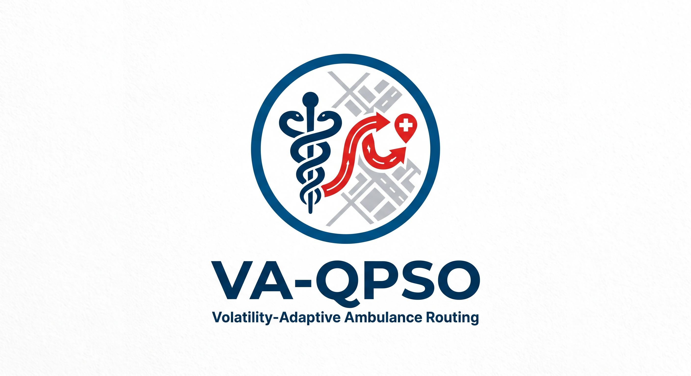
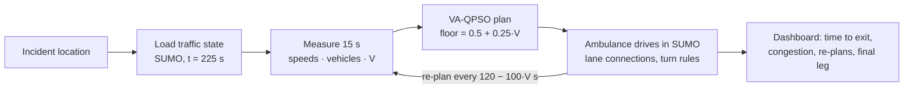
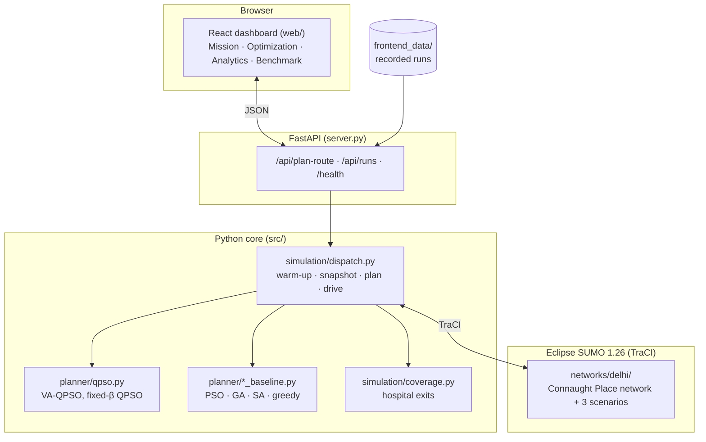

# Quantum-Inspired Intelligent Traffic Route Optimization in Transportation
### Volatility-Adaptive Ambulance Routing (VA-QPSO)

> **SIH 2026 — Problem Statement SIH26137**  
> Traffic-aware ambulance routing for congested Indian cities. A quantum-inspired
> swarm optimiser (VA-QPSO) re-plans the route as traffic changes, and adapts how
> often and how widely it searches to how **unpredictable** traffic is right now.
> Evaluated on a microscopic SUMO simulation of Connaught Place, New Delhi.

| | |
| :--- | :--- |
| **Organization** | Egreen Quanta |
| **Problem Statement** | SIH26137 |
| **Category** | Software |
| **Theme** | Transportation & Logistics |
| **Status** | Working prototype: SUMO simulation + FastAPI backend + React dashboard |
| **Road network** | OpenStreetMap, Connaught Place, New Delhi: 772 road segments, 543 junctions, Delhi Traffic Police speed limits |
| **Traffic** | 3 scenarios (Light / Moderate / Heavy), 8 vehicle types incl. two-wheelers, autos, e-rickshaws, buses |
| **Simulator** | Eclipse SUMO 1.26.0 (pinned) |
| **Tests** | 97 passing (`pytest`) |
| **Live demo (static)** | [Vercel](https://vercel.com/yuvrajsharmaaas-projects/va-qpso-team-innovexa/Ehevzi3HJrRpjvvbauns1YZhC4Js): frontend only, replays recorded SUMO runs |
| **Live demo (full)** | [Render](https://va-qpso-team-innovexa.onrender.com/?screen=mission): real SUMO + FastAPI backend (free tier, see [Live demos](#live-demos)) |
| **Reproducibility** | `python reproduce_demo.py --all` re-derives every number in the demo |



---

## Contents

1. [Problem](#1-problem)
2. [Solution](#2-solution)
3. [Quick start](#3-quick-start)
   - [Live demos](#live-demos)
4. [How it works](#4-how-it-works)
5. [Results](#5-results)
6. [What is measured vs estimated](#6-what-is-measured-vs-estimated)
7. [Architecture](#7-architecture)
8. [API](#8-api)
9. [Benchmarks and experiments](#9-benchmarks-and-experiments)
10. [Testing](#10-testing)
11. [Limitations and roadmap](#11-limitations-and-roadmap)
12. [Data integrity notes](#12-data-integrity-notes)
13. [Repository structure](#13-repository-structure)
14. [References](#14-references)
15. [Team and license](#15-team-and-license)

---

## 1. Problem

- Road accidents killed **1,68,491** people in India in 2022 ([MoRTH, *Road Accidents in India 2022*](https://www.pib.gov.in/PressReleaseIframePage.aspx?PRID=1973295)). Travel time to care is part of every one of those outcomes.
- Indian city traffic is **mixed and volatile**: two-wheelers, autos, e-rickshaws and buses share lanes, and a single closure or rush-hour wave changes road speeds within minutes.
- Ambulance routes are usually fixed at dispatch, from maps or historical averages. By the time the ambulance reaches a junction, the congestion the plan assumed may no longer exist, and new congestion may have formed.
- Re-planning continuously wastes compute in calm traffic; re-planning on a fixed timer reacts too late when traffic turns chaotic.

## 2. Solution

- **Measure traffic now.** Every road segment's speed, the number of vehicles, how many are stopped, and a network-wide **Volatility Index V** (rolling variance of mean speed, 0 = steady, → 1 = unpredictable).
- **Plan with VA-QPSO.** A quantum-behaved particle swarm (QPSO, Sun et al. 2004) orders the route's waypoints between the patient pickup and the hospital exit, on travel times from the measured speeds.
- **Let volatility steer the search.** In standard QPSO the search breadth β shrinks with the iteration count only. In VA-QPSO it shrinks to a **floor that rises with V**, so the swarm keeps exploring alternatives when traffic is unpredictable:
  `β(t) = floor + (1.0 − floor)·(1 − t/T)`, `floor = 0.5 + 0.25·V`
- **Re-plan at a volatility-driven rate.** Every `120 − 100·V` seconds (120 s in calm traffic, down to 20 s in chaotic traffic).
- **Report honestly.** Every time is labelled *simulated drive* (an ambulance actually driven in SUMO) or *planner estimate*; the unsimulated last stretch to the hospital is shown separately as a straight-line distance.

## 3. Quick start

**Requirements:** Python 3.11, Node 20, [Eclipse SUMO 1.26](https://eclipse.dev/sumo/) with `SUMO_HOME` set. Or just Docker.

```bash
# Local
pip install -r requirements.txt
npm --prefix web install
npm --prefix web run build          # builds web/dist/index.html
python server.py --port 8000        # open http://localhost:8000
```

```bash
# Docker (SUMO 1.26.0 pinned inside the image)
docker compose up --build           # open http://localhost:8080
```

```bash
# Frontend development with hot reload (backend on :8000 in another terminal)
npm --prefix web run dev            # open http://localhost:5173
```

**Demo walkthrough**
1. *Open recorded incident* (Light / Moderate / Heavy): replay of a real SUMO drive.
2. Click the map (or *Recorded pickup junction*), pick a traffic level, *Find route*: live plan from the measured traffic (≈ 3 s).
3. Tick *Simulate the drive in SUMO* for a measured drive-through (≈ 20–60 s).
4. *Optimization* shows β, the Volatility Index and the convergence curve; *Analytics* compares adaptive vs fixed schedule on the same traffic.

## Live demos

There are two deployments. They show different things.

| | Vercel (static) | Render (full) |
| :--- | :--- | :--- |
| **URL** | [Vercel Deployment](https://vercel.com/yuvrajsharmaaas-projects/va-qpso-team-innovexa/Ehevzi3HJrRpjvvbauns1YZhC4Js) | [va-qpso-team-innovexa.onrender.com](https://va-qpso-team-innovexa.onrender.com/?screen=mission) |
| **What runs** | React dashboard only | Dashboard + FastAPI + SUMO 1.26 (Docker) |
| **Recorded incidents** (Light / Moderate / Heavy) | Yes | Yes |
| **Find route** (live VA-QPSO plan) | No | Yes |
| **Simulate the drive in SUMO** | No | Yes |
| **Availability** | Always on | Sleeps when idle, wakes on first visit |

**Vercel is a static preview.** It has no backend, so it can only show the recorded runs from `frontend_data/`. It is meant to show the dashboard and what a result looks like, not the working system. Clicking the map or *Find route* will not compute anything there.

**Render is the real system.** Every live plan and drive-through is computed by SUMO and the VA-QPSO planner on the server.

> **Note: the Render instance runs on the free plan.** It spins down after about 15 minutes without traffic. The first request after that takes **around 1 minute** to wake it up (the page may look blank or show a loading error meanwhile). To wake it, open `https://va-qpso-team-innovexa.onrender.com/health` first and wait for the JSON response, then open the dashboard. Live planning takes about 3 s and a SUMO drive-through 20–60 s once it is awake.
>
> If the Render demo is unavailable, use the Vercel link for a preview, or run the project locally (see [Quick start](#3-quick-start)).

## 4. How it works


```mermaid
flowchart LR
    A[Incident location] --> B[Load traffic state<br/>SUMO, t = 225 s]
    B --> C[Measure 15 s<br/>speeds · vehicles · V]
    C --> D[VA-QPSO plan<br/>floor = 0.5 + 0.25·V]
    D --> E[Ambulance drives in SUMO<br/>lane connections, turn rules]
    E -->|re-plan every 120 − 100·V s| C
    E --> F[Dashboard: time to exit,<br/>congestion, re-plans, final leg]
```

**Pipeline** ([`src/simulation/dispatch.py`](src/simulation/dispatch.py))
1. **Warm-up.** Each scenario is simulated from t = 0 (SUMO seed 42) and saved at t = 225 s. Scenarios generate traffic until t = 300 s and their scripted incidents end by t = 220 s (Moderate: closure at 120 s; Heavy: closures at 90 s, surge 100–220 s), so dispatch happens at **t = 240 s**.
2. **Snapshot.** The state is loaded and simulated for 15 s, filling the volatility index's rolling window.
3. **Plan.** Stops are *pickup → planner waypoints → hospital exit*, with fixed endpoints. The travel-time matrix uses measured speeds and SUMO's lane connections for an emergency vehicle.
4. **Drive (optional).** An ambulance vehicle is inserted and driven along the plan, re-planning on the algorithm's cadence, until it reaches the exit, is teleported by SUMO, or 900 s pass.

**VA-QPSO** ([`src/planner/qpso.py`](src/planner/qpso.py))
- Random-key encoding (Bean 1994): a particle position `x ∈ ℝⁿ` decodes to the visit order `argsort(x)`; every position is a valid route.
- Position update (Sun, Feng & Xu 2004): `x ← p ± β·|mbest − x|·ln(1/u)`, `p = φ·pbest + (1 − φ)·gbest`.
- β anneals linearly from 1.0 to the floor; fixed-β QPSO anneals to 0.5 regardless of traffic (identical to VA-QPSO at V = 0).
- Restart on stagnation (patience 15), keeping the best solution across restarts.
- Fitness: travel time T, physical distance D and congestion C, weighted ([`src/planner/fitness.py`](src/planner/fitness.py)); the ambulance pipeline uses travel time only.

**Hospitals** ([`src/simulation/coverage.py`](src/simulation/coverage.py), [`hospitals.json`](hospitals.json))
- Five hospitals with OpenStreetMap coordinates (Moolchand unverified). None lies on a simulated road.
- Each has an **exit junction** (nearest junction an emergency vehicle can reach) and a straight-line distance from it.
- Default destination: Dr. Ram Manohar Lohia Hospital, 1.74 km beyond its exit.

## 5. Results

All numbers below were measured on the current code and network. Each row says how.

### 5.1 Optimisation quality

| Check | Result | Reproduce |
| :--- | :--- | :--- |
| Exact optimum (6 stops, all 720 orders enumerated) | **30 / 30** runs hit the true optimum | `python validate_brute_force.py` |
| Planning time (8 stops, 15 particles × 30 iterations) | **10–44 ms** | `DispatchSession.plan` |
| State extraction (772 edges, batched TraCI) | **0.42 ms** per step | `pytest test_state.py -s` |

### 5.2 Search benchmark (synthetic congestion model)

> Algorithm comparison on a **synthetic** congestion model (random per-edge delay multipliers and occupancies on the real network), **not** measured travel time. 30 seeded instances, 8 stops, up to 600 iterations.

| Algorithm | Mean planned cost (s) | Iterations to 95 % | Hit rate |
| :--- | :---: | :---: | :---: |
| VA-QPSO | 366.97 ± 3.21 | 35.3 ± 27.4 | 100 % |
| Fixed-β QPSO | 366.97 ± 3.21 | 37.4 ± 39.0 | 100 % |
| Standard PSO | 366.97 ± 3.21 | 51.7 ± 61.3 | 100 % |
| Genetic algorithm | 366.97 ± 3.21 | 74.9 ± 73.1 | 100 % |
| Simulated annealing | 366.97 ± 3.21 | 23.2 ± 19.0 | 100 % |
| Greedy nearest-neighbour | 744.05 ± 43.09 | — | 0 % |

- All five metaheuristics find the best-known order in every instance; greedy nearest-neighbour costs **2.0×** more.
- Reproduce: `python experiment.py --mode convergence --num-seeds 30`.

### 5.3 Traffic at dispatch (t = 240 s)

| Scenario | Vehicles | Mean vehicle speed | Stopped | Volatility V |
| :--- | :---: | :---: | :---: | :---: |
| Light | 70 | 18.6 km/h | 5 | 0.28 |
| Moderate | 179 | 12.8 km/h | 28 | 0.07 |
| Heavy | 459 | 9.3 km/h | 139 | 0.23 |

V measures how much speeds are changing, not how slow they are: a jammed network whose speeds stay low reads as *steady*.

### 5.4 Recorded drive-throughs (pickup → Dr. RML exit, 6 waypoints, 900 s cap)

| Scenario | VA-QPSO | Fixed-β QPSO |
| :--- | :--- | :--- |
| Light | not at exit after 900 s (5,465 m at 21.9 km/h) | **852 s** (4,772 m, 20.2 km/h) |
| Moderate | not at exit after 900 s (3,097 m at 12.4 km/h) | not at exit after 900 s (3,097 m) |
| Heavy | not at exit after 900 s (454 m at 1.8 km/h) | not at exit after 900 s (454 m) |

- Routes are long (3.5–5.5 km inside a ~0.9 km area) because they pass all six auto-selected waypoints.
- Heavy traffic is gridlocked in SUMO: the ambulance follows normal traffic rules.
- Reproduce exactly: `python reproduce_demo.py --all`.

### 5.5 All algorithms on real drive-throughs

[`run_real_benchmark.py`](run_real_benchmark.py) drives every algorithm through SUMO (3 scenarios × 6 algorithms × 5 optimiser seeds; the traffic is the same SUMO seed-42 run in every trial).

- **Light:** fixed-β QPSO and greedy nearest-neighbour reached the exit in 5/5 runs (852 s and 866 s); VA-QPSO in 1/5 (777 s); GA 4/5, SA 3/5, PSO 3/5.
- **Moderate and Heavy:** no algorithm reached the exit within 900 s.
- Distance driven before the cap includes waypoint loops, so it is not a measure of progress toward the hospital.

### 5.6 Adaptive vs fixed schedule

- No consistent winner. On the SUMO simulation benchmark, which method had the lower planned tour time **flipped between scenarios and between simulation configurations** (before/after the speed-limit fix, with/without the sublane model), while every seed within a configuration agreed.
- SUMO's sublane model for siren lane-sharing was tested and rejected: the ambulance stalled inside a junction for 558 s (see [`frontend_data/README.md`](frontend_data/README.md)).
- A claim that adaptive routing is faster needs trials with varied traffic, not only varied optimiser seeds.

## 6. What is measured vs estimated

| Shown in the dashboard | Source |
| :--- | :--- |
| Time to network exit, *simulated drive* | SUMO arrival time of an ambulance vehicle |
| Time to network exit, *planner estimate* | Sum of per-edge travel times at the speeds measured at dispatch; no vehicle driven |
| Vehicles, mean speed, stopped | Per-vehicle SUMO measurements each simulated second |
| Unpredictability (V) | Rolling variance of network mean speed (15 s window) |
| Distance from exit to hospital | Straight line, **not simulated**, never added to any time |
| Planner waypoints | Auto-selected junctions, not real places |

A drive still in traffic at 900 s has **no arrival time** and is shown as such.

## 7. Architecture


```mermaid
flowchart TB
    subgraph Browser
        UI["React dashboard (web/)<br/>Mission · Optimization · Analytics · Benchmark"]
    end
    subgraph Server["FastAPI (server.py)"]
        API["/api/plan-route · /api/runs · /health"]
    end
    subgraph Core["Python core (src/)"]
        DS["simulation/dispatch.py<br/>warm-up · snapshot · plan · drive"]
        PL["planner/qpso.py<br/>VA-QPSO, fixed-β QPSO"]
        BL["planner/*_baseline.py<br/>PSO · GA · SA · greedy"]
        CV["simulation/coverage.py<br/>hospital exits"]
    end
    subgraph SUMO["Eclipse SUMO 1.26 (TraCI)"]
        NET["networks/delhi/<br/>Connaught Place network + 3 scenarios"]
    end
    UI <-->|JSON| API
    API --> DS
    DS --> PL
    DS --> BL
    DS --> CV
    DS <-->|TraCI| NET
    REC[(frontend_data/<br/>recorded runs)] --> API
```

| Layer | Technology | Where |
| :--- | :--- | :--- |
| Traffic simulation | Eclipse SUMO 1.26.0, TraCI, sumolib | `networks/delhi/`, `src/simulation/` |
| Optimisation | Python 3.11, NumPy | `src/planner/` |
| Backend | FastAPI, uvicorn | `server.py` |
| Frontend | React 18, TypeScript, Leaflet, Tailwind, Vite (single-file build) | `web/` |
| Analysis | pandas, SciPy, Matplotlib | `experiment.py`, `analyze_experiments.py` |
| Deployment | Docker (multi-stage: Node build + Python/SUMO) | `Dockerfile`, `docker-compose.yml` |

## 8. API

| Method | Path | Purpose |
| :--- | :--- | :--- |
| `POST` | `/api/plan-route` | Live route. Body: `incident_lat`, `incident_lon`, `scenario_tier` (`low`/`medium`/`high`), `seed`, `num_stops`, `drive_through` (bool), optional `hospital_name`. Returns stops, path, metrics, events, `timing`, `traffic_at_dispatch`, `final_leg`. Same body → same response. 503 if SUMO is unavailable. |
| `GET` | `/api/runs/{run_id}` | Recorded run, e.g. `hero_medium_va_qpso` |
| `GET` | `/api/hero-runs`, `/api/hero-runs/{run_id}` | Recorded-run catalogue |
| `GET` | `/health` | Status and SUMO availability |
| `GET` | `/` | Dashboard (`web/dist/index.html`) |

## 9. Benchmarks and experiments

```bash
python reproduce_demo.py --all                               # re-derive every demo number
python export_for_frontend.py --export-heroes                # regenerate recorded runs
python run_real_benchmark.py                                 # all algorithms, real drive-throughs
python experiment.py --mode convergence --num-seeds 30       # synthetic search benchmark
python experiment.py --mode simulation --tiers low medium high --num-seeds 10
python validate_brute_force.py                               # exact-optimum check
python -m src.simulation.coverage                            # hospital coverage
python -m src.simulation.dispatch --prewarm                  # build traffic states
```

Network inputs: `networks/delhi/build_network.py` (OSM → SUMO), `networks/delhi/apply_speed_limits.py` (Delhi limits), `networks/delhi/generate_scenarios.py` (traffic).

## 10. Testing

```bash
pytest                              # 97 tests
npm --prefix web run typecheck && npm --prefix web run lint
```

Coverage includes the fitness function, QPSO (incl. fixed endpoints checked against brute force), all baselines, the volatility index, the replan arbiter, the API, hospital coverage consistency, and validity checks on every recorded run (no negative speeds, timing consistent with status).

## 11. Limitations and roadmap

| Limitation | Next step |
| :--- | :--- |
| The simulated map covers central Connaught Place only (~0.9 × 0.8 km of roads); no hospital lies on it | Import a larger OSM area with the same pipeline |
| Heavy traffic gridlocks in simulation | Signal pre-emption / green-corridor integration |
| Planner waypoints are auto-selected junctions, not real places | Use real intermediate needs (e.g. blood bank pickup) or drop them for direct routes |
| Adaptive vs fixed advantage not established | Trials with varied traffic seeds and larger networks |
| Planner estimate is optimistic (Light, fixed-β: 354 s planned vs 852 s driven) | Calibrate edge delays at signals and queues |
| Simulation only | Pilot on real 108/112 GPS traces |

## 12. Data integrity notes

Earlier versions of this project reported numbers that were not measured. They have been removed:

- Recorded runs used **hard-coded arrival times** (93.55–125.70 s) and hand-written events; they are now SUMO drive-throughs.
- The "25.62 % less congestion", Wilcoxon *p* = 0.002 and A₁₂ = 1.000 results are withdrawn: their 10 "seeds" changed only the optimiser (SUMO ran the same traffic every time), and their "time" was the planner's estimate, not a drive.
- Recorded routes did not start at the patient or end at the hospital; routes now have fixed endpoints.
- The destination was a hospital 7 km outside the map snapped to an edge junction; destinations are now labelled "network exit toward …" with the remaining distance shown separately.
- Live traffic was read 5 s after the simulation started (8–11 vehicles on the network); dispatch now happens at t = 240 s.
- A synthetic fallback generated random traffic when SUMO was unavailable; it has been removed.
- The network used netconvert's default 100 km/h limits; it now uses the Delhi Traffic Police limits.

## 13. Repository structure

```
├── server.py                    FastAPI backend and static dashboard
├── export_for_frontend.py       recorded-run export (SUMO drive-throughs)
├── reproduce_demo.py            re-derive and verify every demo number
├── run_real_benchmark.py        all algorithms on real drive-throughs
├── experiment.py                synthetic search + SUMO simulation benchmarks
├── validate_brute_force.py      exact-optimum check
├── hospitals.json               hospitals with coverage (exit junction, distance)
├── src/
│   ├── planner/                 qpso.py (VA-QPSO), fitness.py, encoding, baselines
│   ├── simulation/              dispatch.py, payload.py, coverage.py
│   ├── volatility/              network volatility index
│   ├── reactive/                replan arbiter, per-hop detours
│   └── state_extraction/        TraCI state extraction, network graph
├── networks/delhi/              OSM extract, SUMO network, speed limits, 3 scenarios
├── frontend_data/               recorded runs served to the dashboard (see its README)
├── web/                         React dashboard
├── docs/SIH_PPT.md              SIH presentation content
├── test_*.py                    test suite
├── Dockerfile, docker-compose.yml
└── archive/                     earlier reinforcement-learning signal-control work
```

## 14. References

1. J. Sun, B. Feng, W. Xu. *Particle swarm optimization with particles having quantum behavior.* IEEE CEC, 2004.
2. J. Kennedy, R. Eberhart. *Particle swarm optimization.* IEEE ICNN, 1995.
3. J. C. Bean. *Genetic algorithms and random keys for sequencing and optimization.* ORSA Journal on Computing, 1994.
4. P. A. Lopez et al. *Microscopic Traffic Simulation using SUMO.* IEEE ITSC, 2018. https://eclipse.dev/sumo/
5. Ministry of Road Transport & Highways. *Road Accidents in India 2022.* https://www.pib.gov.in/PressReleaseIframePage.aspx?PRID=1973295
6. *Capturing delays in response of emergency services in Delhi.* Socio-Economic Planning Sciences, 2023. https://www.sciencedirect.com/science/article/abs/pii/S0038012123000435
7. *Examining district-level disparity and determinants of timeliness of emergency medical services in Maharashtra, India.* Scientific Reports, 2023. https://www.nature.com/articles/s41598-023-48713-1
8. Delhi Traffic Police. Speed-limit notification, 8 June 2021. https://traffic.delhipolice.gov.in/speed-limit
9. OpenStreetMap contributors (ODbL). https://www.openstreetmap.org

## 15. Team and license

| Role | Name |
| :--- | :--- |
| Team lead | Yuvraj Sharma |
| Simulation and network | Anjali Kumari |
| Optimisation and analysis | Vanshika Garg |
| Frontend and backend | Shivam Shaubnik |
| Traffic simulation and testing | Abhishek Gupta |
| Data analysis and evaluation | Ayush Patel |

MIT License.
