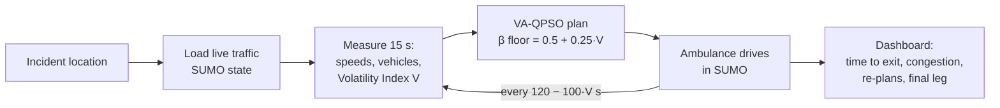

# SIH Idea Presentation: slide content

Six slides, in the order of the SIH template. Each slide has the **on-slide
text** (points only, no paragraphs), a **visual** to place, and **speaker
notes** for the video. Every number is measured in this repository and can be
re-derived; the command is in the last column of the evidence table on slide 4.

Fill in the `[ ]` fields from your SIH registration. Export the final deck as
PDF.

---

## Slide 1: Title

- **Problem Statement ID:** [ ]
- **Problem Statement Title:** [ ]
- **Theme:** [ ] (e.g. Smart Automation / Transportation & Logistics / MedTech)
- **PS Category:** Software
- **Team ID:** [ ]
- **Team Name:** [ ]

**Idea title (large):**
> **GoldenPath (suggested name): traffic-aware ambulance routing that re-plans when the city's traffic turns unpredictable**
>
> *Volatility-Adaptive Quantum-inspired Particle Swarm Optimisation (VA-QPSO) on a real Delhi road network*

**Visual:** full-width screenshot of Mission Control (Heavy traffic, route on the
Connaught Place map).

---

## Slide 2: Proposed Solution

**Detailed explanation of the proposed solution**
- Dispatcher marks the patient's location → system reads **live traffic** →
  plans the fastest ambulance route to the nearest hospital
- Route is **re-planned during the trip** as traffic changes
- Re-plan frequency and search breadth adapt to how **unpredictable** traffic is:
  - calm traffic → re-plan every 120 s, narrow and fast search
  - unpredictable traffic → re-plan as often as every 20 s, wider search for alternative streets

**How it addresses the problem**
- Static routes (planned once, from maps or yesterday's averages) send the
  ambulance into congestion that formed after dispatch
- Our route is rebuilt from **current measured speeds on every road segment**
- Dispatchers see **congestion now** (vehicles, mean speed, stopped vehicles), not a guess

**Innovation and uniqueness**
- **Traffic volatility drives the optimiser.** In existing QPSO variants the
  search breadth (β) depends only on the algorithm's own iteration count. Ours
  also depends on a live, network-wide **Volatility Index V** (rolling
  variance of road speeds): `β floor = 0.5 + 0.25·V`
- **Honest-by-design output.** Every time on screen is labelled either
  *simulated drive* or *planner estimate*; the unsimulated last stretch to the
  hospital is shown separately, never blended into the time
- **Reproducible.** One command (`python reproduce_demo.py --all`) re-derives
  every number in the demo from the simulator

**Visual:** 3-step strip: *Measure traffic → Adapt search (β, re-plan rate) → Route & re-route*.

**Speaker notes:** "An ambulance plan made at dispatch is out of date a few
minutes later. We measure how chaotic traffic is right now, and let that
decide how hard and how often the optimiser searches."

---

## Slide 3: Technical Approach

**Technologies used**

| Layer | Technology |
| --- | --- |
| Traffic simulation | Eclipse **SUMO 1.26** + TraCI (microscopic, vehicle-by-vehicle) |
| Road network | **OpenStreetMap**, Connaught Place, New Delhi (772 road segments, 543 junctions), Delhi Traffic Police speed limits |
| Optimisation | Python 3.11, NumPy: **VA-QPSO** (+ fixed-β QPSO, PSO, GA, SA, greedy baselines) |
| Backend | FastAPI (REST API) |
| Frontend | React + TypeScript + Leaflet map (Vite) |
| Deployment | Docker (SUMO pinned), runs on a laptop CPU, no special hardware |

**Methodology and process for implementation**

- Route always runs **patient pickup → planner waypoints → hospital exit**
- Routing follows real lane connections and turn restrictions for an emergency vehicle
- **Working prototype:** live web dashboard + API + three traffic scenarios (Light / Moderate / Heavy)

**Visual:** the flowchart above (render it at mermaid.live) + small screenshot of
the Optimization screen (convergence chart).

**Speaker notes:** walk the flowchart left to right; point at the loop arrow:
"the calmer the traffic, the less often we re-plan; the more chaotic, the more
often."

---

## Slide 4: Feasibility and Viability

**Analysis of the feasibility (measured on our prototype)**

| Evidence | Result | How to reproduce |
| --- | --- | --- |
| Finds the true best route order | **30 / 30 runs** hit the exact optimum (brute force over all 720 orders) | `python validate_brute_force.py` |
| Better than greedy "nearest next stop" | Swarm methods: **367 s** mean planned route cost vs **744 s** greedy (2.0×), 30 instances, synthetic congestion model | `python experiment.py --mode convergence` |
| Planning speed | **10–44 ms** per plan; live route answer in **≈ 3 s** | server log |
| Real traffic, real drive | Light traffic: ambulance reached the network exit in **852 s** (20.2 km/h, 4.8 km) | `python reproduce_demo.py --all` |
| Footprint | ≈ **66 MB** RAM (Python), ordinary laptop CPU | |
| Automated checks | **97 tests** passing | `pytest` |

- Uses only free, open data and tools (OSM, SUMO); no new hardware on ambulances

**Potential challenges and risks → strategies**

| Challenge | Strategy |
| --- | --- |
| Simulated map covers central Connaught Place only; hospitals lie outside it | Import a larger OSM area (Delhi-wide) with the same pipeline; final leg shown honestly meanwhile |
| Heavy traffic gridlocks in simulation (ambulance: 454 m in 15 min) | Green-corridor / signal pre-emption integration with traffic police; siren lane-sharing model (tested, not yet reliable) |
| Adaptive vs fixed advantage is not yet consistent across scenarios | Larger trials with varied traffic seeds before claiming a speed-up |
| Simulation vs real roads | Pilot on real GPS traces from 108/112 ambulances; calibrate speeds per road |

**Visual:** evidence table + risk table (two columns).

**Speaker notes:** "We show what works and what doesn't yet. Heavy traffic
gridlocks our simulated ambulance, which is exactly why signal pre-emption is
on our roadmap."

---

## Slide 5: Impact and Benefits

**Potential impact on the target audience**
- **Patients:** faster, congestion-aware routes inside the "golden hour"
- **108 / 112 dispatch centres:** one screen with route, live congestion and re-plans
- **Traffic police:** can see where the ambulance will pass → targeted green corridors
- **Hospitals:** a time-to-arrival estimate, clearly labelled as estimate or simulation

**Benefits**
- **Social:** road accidents killed **1,68,491** people in India in 2022 (MoRTH);
  every minute saved on the way to care matters
- **Economic:** software-only; runs on existing computers and existing GPS
  feeds; open-source stack, no licence costs
- **Environmental:** fewer minutes idling in queues → less fuel and emissions
  (same routing applies to fire, police and delivery fleets)
- **Transparency:** every number is traceable and reproducible, suitable for audits

**Visual:** 4 icons (patient, dispatcher, police, hospital) + 1,68,491 in a large number.

---

## Slide 6: Research and References

1. J. Sun, B. Feng, W. Xu, "Particle swarm optimization with particles having
   quantum behavior", *IEEE Congress on Evolutionary Computation*, 2004 (QPSO)
2. J. Kennedy, R. Eberhart, "Particle swarm optimization", *IEEE ICNN*, 1995
3. J. C. Bean, "Genetic algorithms and random keys for sequencing and
   optimization", *ORSA Journal on Computing*, 1994 (permutation encoding)
4. P. A. Lopez et al., "Microscopic Traffic Simulation using SUMO", *IEEE ITSC*, 2018: https://eclipse.dev/sumo/
5. Ministry of Road Transport & Highways, *Road Accidents in India 2022*: https://www.pib.gov.in/PressReleaseIframePage.aspx?PRID=1973295
6. "Capturing delays in response of emergency services in Delhi", *Socio-Economic Planning Sciences*, 2023: https://www.sciencedirect.com/science/article/abs/pii/S0038012123000435
7. "Examining district-level disparity and determinants of timeliness of emergency medical services in Maharashtra, India", *Scientific Reports*, 2023: https://www.nature.com/articles/s41598-023-48713-1
8. Delhi Traffic Police, speed-limit notification, 8 June 2021: https://traffic.delhipolice.gov.in/speed-limit
9. OpenStreetMap contributors, road data (ODbL): https://www.openstreetmap.org
10. Project repository: https://github.com/yuvrajsharmaaa/RLTrafficManagment

**Visual:** QR code to the repository or the deployed demo.

---

## Q&A preparation (not on the slides)

Judges often probe the headline claims. Answer with the measured facts:

- **"Is it faster than normal routing?"** It finds the optimal visit order
  (30/30) and beats greedy nearest-next-stop by 2× on planned cost. Adaptive vs
  fixed-schedule QPSO: no consistent winner yet; the winner changed with the
  simulation configuration, so we don't claim a speed-up.
- **"Is this quantum computing?"** No. Quantum-*inspired*: it runs on an
  ordinary CPU. QPSO borrows the idea of sampling candidates from a probability
  cloud.
- **"Why doesn't the ambulance reach the hospital?"** The simulated map covers
  central Connaught Place; the route is simulated to the exit toward the
  hospital (Dr. RML, 1.7 km beyond). Expanding the map is step one of the roadmap.
- **"Why is Heavy traffic so slow?"** The Heavy scenario gridlocks in SUMO; the
  ambulance obeys normal traffic rules there. Signal pre-emption is the fix.
- **"Can we trust the numbers?"** `python reproduce_demo.py --all` re-runs every
  recorded drive and must match the committed files exactly.

Avoid these claims: "X% faster than Dijkstra/Google Maps", "reduces deaths by
X%", "25.6% less congestion" (from an old run that has been withdrawn).
